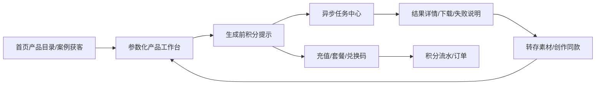

# 筋斗云 AI 工坊全平台拆解与本地产品改造评估

> 目标站：<https://sora2.qunc.com/#/home> 
> 评估日期：2026-07-16 
> 目标站前端版本：`v8.0.14` 
> 本地项目：`AI 图片/视频生成平台`

## 1. 结论先行

不建议把目标站按页面逐个克隆。目标站真正值得参考的不是“有 21 个入口”，而是它已经把 AI 生成业务包装成了一条完整消费链路：

本地平台的任务执行、服务端计价快照、积分冻结/结算/退款、支付回调、内容审核和异常对账底座已经比目标站公开前端所能证明的部分更扎实。当前主要缺口在产品包装层和可发现性，而不在生成底座。

推荐目标不是“筋斗云复刻版”，而是：

1. 保留本地已有任务、计费、支付、审核与网关实现。
2. 新增统一产品目录、模型能力目录、服务端报价、创作配方、素材项目和工具配置层。
3. 把本地已经支持但前端没有充分暴露的首尾帧、商品参考、风格参考、角色参考和视频策略做成清晰控件。
4. 首期不做真 OEM、代理分销、通用大模型 API 转发和专业短剧编辑器。

预估：

| 目标范围 | 单开发者估时 | 建议 |
|---|---:|---|
| 核心竞品体验 | 8-12 周 | 应做，覆盖目录、模型、报价、同款、任务、素材 |
| 较完整商业平台 | 12-18 周 | 在核心指标验证后继续 |
| 真 OEM / 多租户 / 分销 | 另加 30-50+ 个工作日 | 有明确渠道订单后再立项 |

## 2. 评估范围与证据边界

本次采用四类证据：

| 等级 | 证据 | 可得结论 |
|---|---|---|
| A | 浏览器逐路由实测、页面 DOM、公开 GET 接口 | 页面是否存在、公开功能、未登录行为、当前配置 |
| B | 当前线上 `v8.0.14` 前端入口和懒加载组件静态分析 | 路由、表单控件、弹窗、任务/资产/商业模块实现 |
| C | 本地仓库源代码、模型、路由、测试 | 我方现状、复用边界、改造复杂度 |
| D | 由产品名称或 UI 文案推断 | 仅作方向判断，不作为接口承诺 |

已验证：

- 全部公开路由、隐藏路由和角色路由的未登录行为。
- 使用用户授权的普通会员账号完成登录态只读验证；未在文档中记录账号凭据。
- 公开产品、分类、案例、站点配置、定价配置、联系方式和套餐接口。
- 21 个启用产品的实际工作台、输入模式、参数、页面报价和账号内历史入口。
- 首页、提示词库、GIF 工具、资产页、个人页、订阅中心、积分流水以及隐藏原型页。
- 登录账号的历史列表、单条结果详情、资产列表、普通会员的代理/OEM 权限边界。
- 本地仓库的页面、数据库模型、生成请求、任务、计费、支付、审核和对象存储配置。

未验证：

- 未执行生成、支付、兑换、删除、上传、资料修改、代理或 OEM 配置保存等写操作。
- 账号不是代理/OEM 角色，因此代理/OEM 的可编辑表单和保存结果仍来自静态组件证据，而非真实写入验证。
- 因此“生成成功率、真实耗时、供应商返回质量、支付到账、代理/OEM 保存效果”不在本次已证实范围内。
- 本地服务在评估时未运行，本地部分是源码审计，不是本轮运行态验收。

## 3. 目标站完整信息架构

### 3.1 正式公开页面

| 路由/形态 | 页面定位 | 完整功能 | 成熟度与问题 |
|---|---|---|---|
| `/` -> `/home` | 平台首页 | 产品目录、轮播内容、提示词广场、精彩案例、关键词搜索、图片/视频/工具筛选、登录、素材入口、客服与说明链接 | 正式可用；首页内容受站点配置驱动 |
| `/product/:productCode` | 统一产品工作台壳 | 左侧动态产品表单、右侧案例/作品、生成入口、历史入口、结果详情、下载、复制、转存素材、创作同款 | 正式主链路；产品表单实际是编译期 Vue 组件，不是真正配置化 |
| `/prompt` | 公开提示词案例库 | 产品/模型/标签/关键词筛选、分页加载、详情、输入输出素材、复制、关联案例、跳转创作 | 正式可用；匿名用户的完整提示词被模糊处理；详情没有独立 URL |
| `/grid-gif` | 宫格图转 GIF | 上传宫格图、行列、边距、分割线、帧延迟、质量、循环、预览、下载 | 客户端处理基本完整；没有正常菜单入口；上传动作仍受登录限制 |
| `/login` | 登录 | 账号登录、协议/隐私入口、站点品牌背景 | 正式页；背景资源存在 HTTP 混合内容风险 |
| `/register` | 注册 | 激活码注册、账号信息、协议/隐私 | 当前站点配置为 `activation_key` |
| catch-all | 404 | 页面不存在、返回首页 | 正常 |

### 3.2 鉴权和角色页面

| 路由 | 页面定位 | 功能范围 | 实测行为/判断 |
|---|---|---|---|
| `/attachment` | 素材管理 | 图片/视频/音乐，用户上传/AI 生成来源，容量、欠费状态、自定义分组、移动、批删、下载 | 未登录保留页面并提示登录；音频播放明确标注待开发；页面标题仍偏“图片资产” |
| `/profile` | 账户资料 | 头像、用户名可用性、手机号、修改密码 | 未登录时先展示空表单再报获取失败，鉴权体验不完整 |
| `/agency` | 代理商后台 | 下级用户、卡密、套餐、可多次使用卡密、积分划拨、代理等级、联系方式、导出 | 未授权后跳首页；仅渠道业务成立时有价值 |
| `/oem-config` | OEM 配置 | 品牌、Logo、登录素材、公告、客服、小程序、对象存储、画布品牌、自定义菜单、用户管理 | 能力面广但与多租户/渠道强绑定；不是首期能力 |

### 3.3 无菜单、无需登录的隐藏实验/测试页面

| 路由 | 实际内容 | 产品判断 |
|---|---|---|
| `/demo` | Lovart 风格画布：粘贴/上传、图层、缩放、标记、AI OCR/对话 | 原型；公开内部 Demo API 和入口有风险 |
| `/playlet-demo` | “短剧大师”：分镜聊天、资源列表、时间线、字幕、裁剪、复制/删除分镜、对口型/导出按钮 | 高保真静态原型；3 个硬编码视频已 404，聊天只追加处理中 |
| `/playlet-camera` | Three.js 3D 相机控制：方位角、俯仰、距离，生成/复制机位提示词 | 客户端工具可参考，但产品化和中文化不足 |
| `/chat` | 通用 API 调试器：地址、Key、模型、系统提示、温度、Token、流式、附件、请求/响应调试 | 明确测试工具；生产环境不应暴露，也不应让用户在站内填写第三方 Key |
| `/home2` | 硬编码营销页、模型卡、占位案例、固定业务指标 | 模板页；数据不接真实目录，宣传指标无法验证，应下线 |

### 3.4 全局弹窗和非独立路由模块

目标站不少核心能力不是独立页面，而是由全局 Layout 挂载：

| 模块 | 功能 |
|---|---|
| 任务中心 | 进行中任务、统一状态、30 秒轮询、产品/类型筛选、失败任务处理 |
| 历史记录 | 产品/类型筛选、批量删除、清理失败记录、打开结果详情 |
| 结果详情 | 预览、下载、复制、刷新、转存素材、创作同款、失败分析 |
| 用户中心 | 永久积分、限时积分、每日积分、套餐、订单、兑换码、积分流水 |
| 公告/客服 | 公告、联系方式、使用说明 |
| 充值 | 套餐选择、下单、支付状态 |

目标站的“页面少但全局闭环完整”值得借鉴。我们不应为了路由数量把每个弹窗机械地做成一个页面。

### 3.5 登录态只读验证结果

使用用户授权的普通会员账号完成了以下实测；未发起任何生成、支付、兑换、上传、删除或保存操作：

| 模块 | 登录态实测结果 | 新发现的问题/判断 |
|---|---|---|
| 登录 | 登录成功后回到 `/home`，顶部显示积分和会员入口 | 基本闭环正常 |
| 全局任务中心 | 当前账号审计时没有进行中任务，抽屉为空 | 空状态几乎没有说明；固定 30 秒轮询仍会持续请求 |
| 全部历史 | 共 174 条、10 条/页；支持图片/视频/工具和产品筛选、管理、清除 5 条失败记录 | 过滤器只列出 18 个分类产品，继续印证目录漂移 |
| 作品详情 | 展示产品、模型、状态、任务 ID、处理耗时、创作时间、积分、24 小时原始地址、参考素材；支持复制、下载、生成角色、创作同款 | 信息完整，值得参考；原始地址过期后必须依赖平台转存，需明确生命周期 |
| 资产管理 | 共 126 条、18 条/页；上传/AI 来源、图片/音乐/视频、分组、批量、分页 | 页面显示 `747.58 MB / 50 MB`，但没有清晰解释超额后的上传、保留、欠费和清理规则 |
| 个人资料 | 头像、用户名、已绑定手机号、原/新密码、保存/重置；下方嵌入历史预览 | 功能完整；不应在资料页默认加载大量生成提示词 |
| 订阅/积分中心 | 总积分拆为永久、限时、每日；套餐、订单、卡密、积分记录四个页签 | 账号在限时积分为 0 时仍显示“剩余 200 天”，到期提示逻辑容易误导 |
| 积分流水 | 能看到消耗/退款、永久积分类型、模型、部分输入/输出 Token、时间；失败/超时有自动退回记录 | 计费透明度是强项；“冻结/预扣/结算”最好进一步分阶段展示 |
| 代理 `/agency` | 普通会员被重定向首页并提示仅代理可访问 | 后端角色边界有效，但路由仍会短暂挂载角色页面状态 |
| OEM `/oem-config` | 提示未开通 OEM，并重定向首页；错误信息复用了“仅限代理” | OEM 与代理权限/错误语义耦合，不宜照搬 |
| 设置 | 点击后明确提示“设置功能开发中” | 不应把占位入口放进正式账户菜单 |

额外发现：Layout 的历史模块在个人资料、资产页和多个工作台都被挂载，页面 DOM 会加载近期任务提示词。对当前用户自己并非越权，但会增加首屏请求、DOM 体积和敏感创作内容的暴露面。我方应按需加载历史抽屉，关闭时不请求完整记录。

## 4. 21 个启用产品完整目录

线上公开产品 API 当前返回 21 个启用产品：8 个视频、5 个图片、8 个专项工具/API 产品。分类接口只返回 18 个，漏掉 `gpt-image`、`jimeng-image`、`claw`，说明其产品目录和分类配置已经产生数据漂移。

### 4.1 视频产品（8 个）

下表参数来自登录态工作台和当前 SPA 组件。页面积分是 2026-07-16 的动态快照，只用于理解计费交互，不应直接成为我方定价依据。

| 产品/代码 | 输入模式与关键参数 | 当前模型/计费表达 | 我方处理建议 |
|---|---|---|---|
| Grok 视频 `grok-video` | 经典模式：提示词 + 可选单图、5 种比例、6/10 秒、1/3/5/10 条；G1.5：必传单图、9:16/16:9、10/15 秒 | `grok-video-3/-10s/-15s`、`grok-video-1.5-preview`；固定价或按秒×数量；登录态 G1.5 默认示例为 200 积分 | 归入统一视频工作室的 Grok 渠道/预设，不建独立业务代码 |
| Veo3.1 视频 `veo-video` | 文生、首帧/首尾帧、1-3 张参考图；Fast/标准/Pro；标准/Pro 可 4K；9:16/16:9；1/3/5/10 条；翻译、自动配乐、10 个模板 | `veo3.1-fast/veo3.1/veo3.1-pro` 及 4K 变体；模型固定价×数量 | 把模型、清晰度、参考图上限写入能力版本；保留首尾帧和模板体验 |
| Sora 视频 `sora-video` | 提示词 + 可选单图；9:16/16:9；第三方/官方渠道；官方 4/8/12 秒；1/3/5/10 条；流式润色；私有/公共角色搜索；用 1-3 秒视频建角色、编辑/删除角色 | 官方按秒，其他渠道固定价；真实结果详情可显示模型、任务 ID、耗时、积分和 24 小时原始地址 | 模型渠道并入统一工作室；“角色库”做成跨模型资产能力，优先级高于 Sora 专页 |
| 通义万象 `wan-video` | 文生、图生、视频换角、图像动作迁移；普通模式可带音频，720/1080p、5 种尺寸、5/10/15 秒；换角/动作各需 1 图 + 1 视频 | `wan2.6-t2v/i2v[-flash]`、`wan2.2-animate-mix/move`；普通模式配置价，换角/动作按上传视频时长 | 普通生成并入工作室；换角/动作作为高级配方，先做质量与合规验证 |
| 即梦 `jimeng` | 首帧或首尾帧、提示词；6 比例、480/720/1080p、4-12 秒；声音、样片速览、固定镜头、seed | 页面名为“即梦2.0”，实际模型 `doubao-seedance-1-5-pro-251215`；Token 折算预估积分；登录态默认示例 1037 积分 | 必须按真实模型 ID 修正为 Seedance 1.5 Pro，不允许与 2.0 共用名称 |
| Seedance 2.0 `seedance2` | 官方：最多 10 图、3 视频、3 音频，引用视频总长不超过 15 秒；Mini/Fast/Full，480/720，Full 可 1080；6 比例、5-15 秒、seed。真人融合：最多 9 图 + 1 音频、4-15 秒、强制声音 | 官方按 Token 预授权后按实结算/退款；真人融合按秒固定价；登录态默认示例显示 324,000 tokens、预扣 4099 积分、多退少补 | 最值得参考多模态引用编排、前端上限校验和预授权/差额退款；作为统一视频工作室核心能力 |
| 快乐小马 `happyhorse` | 文生、单图图生、2-10 图融合；v1.0/1.1；720/1080p；7 比例，图生可继承源图；4-15 秒 | 按秒计费；登录态默认示例 `happyhorse-1.1-t2v-720p` 为 135 积分/秒 | 作为多图融合预设；必须保存完整参数以支持重放 |
| Veo-omni `veo-omni` | Omni：文生、最多 7 图融合、单视频编辑；Veo 优惠：文生、1-2 帧、1-3 参考图；Fast/标准/HD、横/竖 720p | `omni_flash-10s` 与多个 `veo_3_1*` 变体；固定模型价；登录态 Omni 默认示例 480 积分 | 与 `veo-video` 合并成 Veo 渠道组，不应并列维护两个产品 |

### 4.2 图片产品（5 个）

| 产品/代码 | 输入模式与关键参数 | 当前模型/计费表达 | 我方处理建议 |
|---|---|---|---|
| Banana 作图 `nano-banana` | 最多 14 张参考图；AI 润色、视角助手；10 个常规比例，Banana 2 另有 4 个极端比例；1K/2K/4K；1/3/5/10 张；异步/同步；快速本地下载可不留服务端作品 | Banana 2/Pro/Banana 与 Gemini preview/pro 多渠道计价 | 统一图片工作室主模型；多参考图、视角助手和明确的“不入库”模式值得复用 |
| Grok 图片 `grok-image` | 可选单图、提示词；Auto/1:1/3:2/2:3 | `grok-4.2-image` 固定积分；登录态默认示例 48 积分 | 作为模型渠道；标题“构客 图生图”与可不传图不一致，应修正文案 |
| Qwen 图片 `qwen-image` | 实际混装 Wan2.7、Qwen Image 2.0/Pro、Z-Image；按模型最多 3 图；10 比例 + 自定义尺寸；1K/2K；最多 6 张，Z 仅 1 张/1K | 按模型固定价；登录态 Wan2.7 默认示例 80 积分/张 | 拆成模型选择，不能让 Qwen 页面承载三个品牌；自定义尺寸可复用 |
| GPT 图片 `gpt-image` | 最多 6 图；官方/折扣渠道；8 比例或受限自定义尺寸；1K/2K/4K；low/medium/high；1/3/5/10 张 | `gpt-image-2-official`、`gpt-image-2`；官方展示输入/输出 Token、输出预估与 3 倍预扣/退款；登录态默认约预扣 66 积分 | 透明估价值得复用，但模型、价格和预扣倍数必须由服务端版本化 |
| 即梦图片 `jimeng-image` | Seedream 4.5/5.0；最多 14 张参考图；提示词；2K/4K | 固定模型积分；登录态默认示例 111 积分，UI 未清楚解释分辨率差价 | 与 Seedance 视频分开命名；补齐价格解释和分类入口 |

### 4.3 专项工具/API 产品（8 个）

| 产品/代码 | 完整工作流 | 当前模型/计费表达 | 我方建议 |
|---|---|---|---|
| 局部编辑 `local-edit` | 原图 + 可视化画笔蒙版（颜色/笔刷尺寸）+ 可选替换图 + 编辑提示；1K/2K/4K | 按 `nano-banana-pro` 计价 | 保留为独立画布工具；本地需补可用的蒙版编辑器，而不是只做表单模板 |
| 一键仿图 `poster-generation` | 参考图 -> 流式视觉/提示分析 -> 可编辑提取提示 -> 1K/2K/4K 生成 | 分析和生成分阶段计费；账号流水实测能分别记录“海报图片分析”和生成/退款 | 本地已有反推内核，P1 作为组合配方低成本实现 |
| 无损改字 `word-modification` | 原图；旧字/新字引导或自定义提示；1K/2K/4K | 图片编辑固定价 | 在生成前增加 OCR 和区域确认；仅靠提示词无法保证字体、排版和未编辑区域无损 |
| 手持产品 `hold-product` | 人物/模特图 + 产品图；可选自定义提示；1K/2K/4K | `nano-banana-pro` 固定价；账号流水实测存在 300 积分消耗和超时退款 | 本地主体保护与商品参考可直接承载，适合作为 P1 首批商业配方 |
| 一键换装 `change-clothes` | 服装图 + 模特图；提示/选项、比例、1K/2K/4K | 图片生成固定价 | 人物编辑配方；需身份一致性、服装保真和内容安全验收 |
| 一键成片 `story-board` | 最多 5 张产品/参考图 + 产品名/卖点；先生成固定 16:9 分镜，再生成 9:16/16:9 成片；支持参数回放 | 分镜图片与视频分阶段生成/计费 | 升级为项目型工作流：脚本/分镜可编辑、镜头级重生成、最终合成；不照搬静态短剧原型 |
| 视频反推 `video-reverse` | MP4 上传或 URL；预设/自定义系统提示；可选视觉模型；解析抖音/快手/小红书分享文本；独立历史 | 分析按 Token、地址解析按次；账号流水实测能显示模型与输入/输出 Token；历史仅保留 20 条且标注临时 | 本地已有链接解析、抽帧和反推；并入统一历史并提供结构化结果/一键回填 |
| Claw 龙虾 `claw` | 获取/重置 SK Token；OpenAI `/v1/chat/completions` 和 Anthropic `/messages` 示例；内置多模型聊天；飞书/企微等 OpenClaw 接入说明 | 登录后直接展示 API 地址、Token 操作和模型单价；如 Kimi 输入 1.6、输出 8.4 积分/K | 不是媒体创作能力，应移出核心目录；若做，需独立开发者中心、安全和用量账单立项 |

### 4.4 产品层关键判断

目标站虽然有 21 个产品，但公开接口里的 `form_config` 和 `default_params` 均为空。各产品表单通过构建期组件文件动态加载，仍是“每个产品一个前端组件”。这使产品上线速度依赖发版，也导致：

- 分类接口与产品列表发生漂移。
- 两个不同模型都展示为“即梦2.0”。
- 价格、模型 ID 和部分公式分散在前端 bundle。
- 产品越多，重复表单逻辑和回归范围越大。

我方应该参考其产品化效果，但不要复制其实现方式。

## 5. 内容、任务、素材和商业化模块

### 5.1 提示词/案例内容系统

当前公开案例约 225 条。核心能力包括：

- 按产品、模型、标签、关键词过滤。
- 案例详情展示输入资源、输出资源和元数据。
- 匿名用户可浏览结果，完整提示词模糊，形成注册转化。
- 复制提示词、相关推荐和“用此提示词创作”。

我方最该参考的不是案例瀑布流，而是“案例携带完整可执行参数”。本地 `UserPrompt.params` 已有 JSON 字段，可升级为版本化 `CreationRecipe`，把模型、提示词、比例、清晰度、时长、参考图角色、策略和随机种子一起回填。

### 5.2 任务与结果

目标站功能完整，但固定每 30 秒轮询会导致短任务反馈慢、长时间后台请求浪费。建议我方采用现有 WebSocket/状态能力，并补：

- 全局可见的进行中任务计数。
- 阶段、排队位置/预计耗时（供应商可提供时）。
- 失败分类、可执行建议、是否退款。
- 原参数重试、切换兼容模型重试。
- 结果转素材、复制任务参数、创建同款。

### 5.3 素材管理

目标站的优点是把上传素材和 AI 结果都放进一个用户可见资产系统，并支持分组和批处理。其不足是音频未完成、名称不一致、对象存储配置过度暴露给 OEM。

我方当前 `UploadedAsset` 与 `GenAsset` 分离，应保留底层来源审计，但在 API/UI 上提供统一 `AssetView`，再增加：

- 文件夹/项目。
- 来源、媒体类型、模型、时间筛选。
- 上传素材和生成结果统一选择器。
- 软删除、批量移动、收藏、下载。
- 存储配额和生命周期策略。

### 5.4 积分、套餐和渠道

目标站公开配置中 `points_per_yuan = 100`，但公开套餐并非固定兑换率：

| 套餐类型 | 示例 |
|---|---|
| 积分包 | 100 积分/5 元；1000/10 元；5000/50 元；10000/100 元；20000/200 元 |
| 时效套餐 | 体验日卡 1 元/100 积分；年卡 99 元/不同积分配置 |
| 渠道 | 激活码注册、兑换码、代理生成卡密、积分划拨 |

因此不能把“1 元 = 100 积分”写成财务事实。供应商成本、平台积分标价和套餐折扣必须分开管理。

我方建议先做：

- 生成前服务端报价。
- 永久/限时积分可选的话，明确消费顺序和到期规则。
- 订单、支付状态、积分流水、退款说明。
- 套餐版本快照，避免改价影响历史订单。

优惠券、会员日权益、代理卡密和多层级分销后置。

## 6. 目标站值得参考与不能照搬的内容

### 6.1 直接参考

| 能力 | 原因 | 我方落点 |
|---|---|---|
| 产品目录 + 搜索/分类 | 降低模型选择成本 | 新 AppShell 和模型/工具目录 |
| 统一工作台壳 | 模型不同但交互一致 | 能力矩阵驱动控件 |
| 案例到创作 | 内容直接转化为生成 | 版本化 Recipe 精确回填 |
| 全局任务中心 | 用户离开工作台后仍能跟踪 | 复用现有任务状态，增加全局入口 |
| 结果到素材 | 生成结果沉淀并可复用 | 统一素材选择器与文件夹 |
| 生成到计费流水 | 用户能理解消费与退款 | quote + 计费明细 |
| 专项工具包装 | 把多步 AI 流程变成任务 | 配置化 Tool/Workflow |

### 6.2 需要改造后参考

| 目标站做法 | 问题 | 我方改造 |
|---|---|---|
| 每产品一个编译组件 | 重复、需发版、容易漂移 | 能力 schema + 少量专用 renderer |
| 30 秒固定轮询 | 反馈慢、请求浪费 | WebSocket/SSE + 自适应回退 |
| 分散的页面鉴权 | 未登录行为不一致 | 统一路由守卫和 401 状态 |
| 前端展示预计积分 | 可被篡改、公式易漂移 | `/api/quotes` 服务端权威报价 |
| 案例详情弹窗 | 不可分享、SEO/归因弱 | 独立可分享 Recipe URL |
| 上传/生成素材混合展示 | 来源审计容易丢失 | 统一视图但保留来源模型 |
| OEM 直接配置对象存储 | 秘钥和数据隔离风险 | 平台托管存储；企业版由后端安全配置 |

### 6.3 明确不照搬

- 21 个硬编码产品页面。
- 重复/误导性的模型名称和“秒杀”等非专业文案。
- 前端权威价格或客户端提交即可生效的 `estimated_credits`。
- 公开 `/chat`、`/demo`、`/home2` 等测试页面和内部 API。
- 尚未完成却进入正式菜单的占位能力。
- 无法证明的“10 万+、99.9%”营销指标。
- HTTPS 页面加载 HTTP 素材、失效视频和不稳定 CDN 资源。
- 在没有渠道订单前建设代理层级、卡密工厂和真 OEM。

## 7. 本地平台现状与差距

### 7.1 已有可复用底座

| 本地能力 | 代码证据 | 结论 |
|---|---|---|
| 异步生成任务 | `GenTask`、Celery、任务状态与 WebSocket | 保留并扩展全局任务 UX |
| 服务端计价 | `generation_pricing.py`、任务价格快照 | 比复制前端价格更正确 |
| 幂等生成 | `client_request_id` 唯一约束、请求 fingerprint | 保留，Recipe 重放继续复用 |
| 积分闭环 | `credits.freeze/settle/refund` | 保留，不另建账本 |
| 支付闭环 | 支付回调、订单幂等、主动对账 | 保留，补用户侧明细即可 |
| 生成异常处理 | `needs_review`、人工结算/退款路径 | 保留并暴露可理解的失败状态 |
| 内容安全 | 生成内容审核和下架状态 | 专项工具继续复用 |
| 多参考视频参数 | 首帧、尾帧、商品、风格、角色引用 | 后端已有，前端优先开放 |
| 视频提示词编译 | 多种商品视频策略 | 后端已有，前端不应固定成一种 |
| 提示词参数 | `UserPrompt.params` | 可迁移为 Recipe 雏形 |
| 运维后台 | 当前管理页已有 11 个业务标签 | 扩展模型/产品/Recipe 配置，不重写后台 |

### 7.2 当前关键阻塞

| 问题 | 当前证据 | 影响 | 改造 |
|---|---|---|---|
| 导航固定 | `frontend/components/Nav.jsx` 固定 LINKS | 新产品只能改代码 | AppShell 从目录 API 渲染 |
| 创作模式固定 | `frontend/app/studio/constants.ts` 仅 4 种 | 难表达模型/工具差异 | 模型能力与工作流 schema |
| Studio 单页过大 | `frontend/app/page.jsx` 聚合大量逻辑 | 扩模型回归风险高 | 拆工作台壳、参数区、结果区、素材选择器 |
| 每类用途仅一模型 | `ModelConfig.use` 有唯一索引 | 无法真正多模型选择 | 新 ModelCatalog/Route；迁移旧配置 |
| 视频策略被前端固定 | `generationPayload.ts` 固定 `prompt_driven` | 后端已有策略不可见 | 策略卡和兼容矩阵 |
| 历史“做变体”不精确 | `history/page.jsx` 使用硬编码提示词 | 不是创作同款 | 保存/重放完整 Recipe |
| 素材模型分离且无文件夹 | `UploadedAsset` 与 `GenAsset` | 跨任务复用成本高 | 统一视图 + AssetFolder/Project |
| 对象存储生产能力被阻断 | `runtime_config.py` 明确拒绝相关配置 | 规模化媒体不可行 | 存储适配器、迁移与生命周期 |
| 高级参数后端强、前端弱 | 生成请求已支持多类 reference | 用户看不到差异化价值 | 显式引用插槽和模型能力校验 |

## 8. 推荐目标架构

### 8.1 产品组织原则

把“模型”“工作流”“工具”分开：

- 模型：供应商能力和价格，如 Seedance 2.0、GPT Image 2。
- 工作流/配方：用户任务，如商品展示视频、首尾帧转场、一键仿图。
- 工具：有专用交互或多阶段编排的能力，如局部编辑、视频反推、GIF。

同一个模型可服务多个配方；同一个配方可切换多个兼容模型。这样既能做到目标站一样的丰富入口，又不会制造 21 套重复业务代码。

### 8.2 建议新增数据模型

| 模型 | 关键字段 | 用途 |
|---|---|---|
| `ModelCatalog` | slug、名称、供应商、媒体类型、状态、排序、标签 | 用户可见模型目录 |
| `ModelCapabilityVersion` | schema_version、输入插槽、比例、时长、分辨率、参数约束 | 决定表单控件和校验 |
| `ModelPriceVersion` | 计费维度、单位成本、积分价、生效时间 | 历史可追溯报价 |
| `ModelRoute` | 模型、供应商端点、优先级、降级策略、健康状态 | 运行时路由，不向前端暴露秘钥 |
| `CreationRecipe` | owner、公开状态、封面、当前版本、统计 | 提示词案例/用户配方实体 |
| `CreationRecipeVersion` | prompt、model、capability_version、params、references | 精确“创作同款” |
| `AssetFolder` | owner、parent、名称、排序 | 素材文件夹/项目 |
| `ToolDefinition` | slug、名称、入口、渲染器、状态 | 专项工具目录 |
| `ToolVersion` | input_schema、workflow、pricing_policy、版本 | 可回滚的工具编排 |

不建议直接删除旧 `ModelConfig`。先以兼容适配层读取旧配置，完成数据迁移和双读验证后再逐步退役其 `use` 唯一约束。

### 8.3 建议 API

| API | 责任 |
|---|---|
| `GET /api/models` | 返回当前可售模型及摘要能力，不返回供应商秘钥/内部路由 |
| `GET /api/models/{slug}` | 返回指定能力版本、控件 schema、限制和展示价 |
| `POST /api/quotes` | 对规范化请求进行服务端权威报价，返回 quote_id、价格版本、过期时间 |
| `POST /api/generate` | 接受 quote_id + 规范化请求，服务端重新校验并创建现有 GenTask |
| `GET/POST /api/recipes` | 创建、查询、收藏、公开配方 |
| `GET /api/recipes/{id}/versions/{v}` | 获取可精确回填的版本化参数 |
| `GET/POST/PATCH /api/folders` | 素材文件夹/项目管理 |
| `GET /api/assets` | 统一返回上传与生成素材视图 |
| `GET /api/tools` | 返回可用专项工具和版本 |

报价安全要求：前端只显示 `estimated_credits`，最终冻结金额必须由有效 `quote_id` 和服务端价格版本决定；客户端金额永远不能作为结算依据。

## 9. 分阶段改造路线

### P0：形成“像一个平台”的主体验（3-5 周）

1. AppShell 与统一产品目录。
2. 模型目录、能力版本和模型路由基础表。
3. 服务端 `/api/quotes`、报价版本与生成请求绑定。
4. 工作台根据能力矩阵展示模型、比例、时长、清晰度和参考插槽。
5. 全局任务中心入口，复用现有任务状态。
6. 统一鉴权守卫和 401/403 页面状态。

验收：后台新增模型无需修改工作台业务代码；不兼容参数在提交前被阻止；任何客户端篡改价格均不能改变冻结金额。

### P1：打通复用闭环（3-5 周）

1. `CreationRecipe` 和版本化精确回填。
2. 案例详情独立 URL、“创作同款”、收藏和使用统计。
3. 统一素材选择器、文件夹/项目、批量移动。
4. 对象存储适配器、历史资源迁移和生命周期策略。
5. 显式首帧/尾帧/商品/风格/角色插槽。
6. 把已有商品视频策略做成可理解的策略卡。

验收：从任一成功任务进入同款创作后，模型、提示词、参数和引用角色可完整重现；上传和生成素材可在同一选择器复用。

### P2：专项工具与商业透明度（3-5 周）

1. `ToolDefinition/ToolVersion` 与多阶段编排。
2. 首批工具：视频反推、一键仿图、手持产品；GIF 可作为纯客户端工具。
3. 局部编辑蒙版的最小可用版本。
4. 用户侧积分流水、订单、退款原因和套餐版本。
5. 任务详情增强：失败类型、建议、重试/切换模型。

验收：一个新模板类工具可在 1-3 天内配置上线；关键失败场景用户能判断是否扣费、是否可重试。

### P3：项目式复杂创作（按业务数据立项）

1. 分镜/故事板项目。
2. 多镜头资产和角色一致性。
3. 简化时间线、镜头排序、批量生成和导出。
4. 多模型串联工作流。
5. 订阅权益、优惠券或轻量单租户白标。

不在 P3 默认范围：专业 NLE、复杂关键帧、真正多人协作、真多租户 OEM、代理分销。

## 10. 工作量拆分

| 工作项 | 单开发者估时 | 依赖/说明 |
|---|---:|---|
| AppShell/工具目录 | 4-6 天 | 目录 API、导航与权限 |
| 多模型目录/能力版本 | 8-12 天 | 数据迁移、表单 schema、后台 |
| 版本化生成报价 | 4-6 天 | 复用现有计价与积分冻结 |
| 精确“创作同款” | 3-5 天 | Recipe/版本/引用快照 |
| 任务中心增强 | 2-4 天 | 复用现有任务和 WebSocket |
| 素材文件夹/项目 | 4-7 天 | 统一资产视图 |
| 对象存储适配/迁移 | 5-8 天 | 需灰度、回滚、生命周期 |
| 配置化工具框架 | 6-10 天 | 此后普通工具约 1-3 天/个 |
| 视频高级控制 UI | 2-4 天 | 后端已支持大部分参数 |
| 基础账单/套餐用户 UI | 2-4 天 | 不含复杂订阅权益 |
| 轻量单租户白标 | 3-5 天 | Logo、名称、主题、客服 |
| 真 OEM/多租户 | 30-50+ 天 | 隔离、域名、存储、账单、运维均需设计 |

两人小组建议分工：一人负责模型/任务/计费/API，一人负责 AppShell/工作台/素材/Recipe。这样核心体验可压缩到约 5-7 个自然周，但对象存储迁移和账务校验不能靠并行简单压缩。

## 11. 验收指标

### 11.1 产品指标

| 指标 | 建议目标 |
|---|---:|
| 首页到发起生成转化率 | 上线前基线之上提升 20% |
| 案例到“创作同款”点击率 | >= 8% |
| 同款回填后成功提交率 | >= 70% |
| 生成结果转存素材率 | >= 20% |
| 7 日内素材复用率 | >= 15% |
| 新用户首次成功生成耗时 | 中位数 <= 5 分钟 |

### 11.2 工程与财务指标

| 指标 | 验收标准 |
|---|---|
| 报价一致性 | quote、冻结、结算均能追溯价格版本；客户端改价无效 |
| 幂等性 | 相同 client_request_id 不重复建任务/扣费 |
| 账务一致性 | 余额 + 冻结与流水可对账，失败任务按策略退款 |
| 模型配置 | 新增同类模型不修改工作台业务代码 |
| Recipe 重放 | 关键字段 100% 回填，引用素材缺失时明确提示 |
| 资产安全 | 所有资产按 owner 校验；跨用户/跨租户不可读取 |
| 任务反馈 | 状态变化实时或秒级可见；断线后可恢复 |
| 可观测性 | 按模型/供应商统计成功率、P50/P95 时延、成本、退款率 |
| 兼容性 | 桌面/移动端无参数区遮挡，长模型名和错误文案不溢出 |

## 12. 风险与前置决策

| 风险 | 需要的决策/控制 |
|---|---|
| 模型供应商能力频繁变化 | 能力、价格、路由全部版本化；禁止写死在页面 |
| 多模型价格不可直接比较 | 分开记录供应商成本、平台积分价、套餐折扣 |
| Recipe 引用外部 URL 失效 | 入库时转存或生成受控快照，记录授权/来源 |
| 对象存储迁移影响历史作品 | 双写、抽样校验、可回滚、旧 URL 保留期 |
| 工具数量增长导致复杂度回潮 | 80% schema 驱动，20% 专用 renderer；不追求任意 UI 配置化 |
| 角色/商品一致性结果不稳定 | 用能力标签和质量门槛控制可售模型，不承诺模型做不到的结果 |
| OEM 引入数据隔离和合规风险 | 没有付费渠道需求前不建设；建设时按真租户隔离立项 |

## 13. 推荐的一期范围

一期不要以“上线多少个模型”为成功标准。建议只选择 3 个图片模型、3 个视频模型和 3 个工具入口，把闭环做完整：

- 图片：通用文生图、参考图编辑、商品图。
- 视频：通用文生视频、首尾帧视频、商品参考视频。
- 工具：视频反推、一键仿图、手持产品。
- 公共能力：目录、quote、任务、结果、Recipe、素材、积分流水。

一期完成后再根据真实使用数据决定局部编辑、换装、故事板、订阅和白标。这样能获得目标站最有价值的产品体验，同时避免把其硬编码产品页、渠道系统和实验原型一起背进本地架构。

## 14. 最终建议

本项目应该做“能力平台化”，而不是“页面数量竞赛”。最优改造顺序是：

1. AppShell + 模型能力目录 + 服务端 quote。
2. Recipe 精确同款 + 统一素材/项目 + 对象存储。
3. 配置化专项工具 + 高级视频参数 + 账单透明。
4. 项目式分镜和多模型工作流。
5. 只有出现真实渠道订单时，才建设 OEM/代理。

按这个顺序，本地平台可以在不推翻成熟后端的前提下，用 8-12 个单开发者周达到目标站最核心的“多产品、易发现、可复用、可计费”体验，并在任务可靠性和账务正确性上保留自己的优势。
