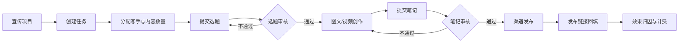

# 同程 MCN 智能内容营销平台完整功能拆解分析

> 调研对象：<https://tcwlservice.17usoft.com/market/mcn/creation/graphic-text>
> 调研时间：2026-07-17
> 当前生产构建：`1784277294515`
> 调研方式：刷新后复用用户登录态进行只读页面走查，并与当前生产静态构建、菜单、路由、组件及 API 声明交叉核对。未执行生成、保存、发布、删除、收藏、上传、导入、导出、账号托管或计费调整等写操作。

## 一、结论先行

这个平台不是单一的“AI 图文生成工具”，而是一套面向 MCN/内容营销团队的全流程内容运营工作台。它覆盖了：

```text
趋势与竞品洞察
    -> 选题/任务规划
    -> 图文或视频生产
    -> 素材、模板、账号与人员协同
    -> 审核与发布
    -> 内容效果和业务转化归因
    -> 成本核算与计费管理
```

平台最有辨识度的并不是“接入了哪些生成模型”，而是三项业务能力：

1. **旅游内容垂直化**：把酒店、景区、城市、火车、机票、商品等业务资源直接接入创作流程。
2. **组织化生产**：把运营组、写手、社媒账号、宣传项目、任务、选题、审核、回填串成团队工作流。
3. **投放闭环化**：不仅统计曝光、阅读和互动，还继续追踪进站 UV、新客、航段和出票订单，并把内容、账号托管和 AI 助手成本纳入计费。

因此，它更接近“内容营销生产与运营中台”，而不是面向个人创作者的轻量 AI 写作产品。

## 二、证据等级与分析边界

| 标记 | 含义 | 本报告中的使用方式 |
| --- | --- | --- |
| E1 | 登录后页面实测 | 当前账号真实可见页面、字段、选项、状态、数据与只读交互 |
| E2 | 当前生产代码已部署 | 菜单、路由、组件、交互文案、接口声明存在 |
| E3 | 基于 E1/E2 的产品判断 | 产品定位、优劣势、重构优先级 |
| NV | 未完成运行态验证 | 需要真实账号、空间、角色或写操作才能确认 |

需要特别强调：

- 目标入口当前返回 HTTP 200，刷新后完成同程 OAuth 回跳并自动复用用户登录态。
- 当前实测空间为“研发运维（视频）”，支持媒体为小红书；报告不记录页面中出现的成员姓名、手机号等个人信息。
- 未登录请求用户授权菜单时会跳转统一 OAuth，说明真实功能受账号授权控制。
- 路由或组件存在，只能证明代码已部署，不能证明所有空间、所有角色都能看到或调用成功。
- 本次确认了页面可见性、筛选项、表单、状态、已有费用数据和预览能力，但没有真正触发生成、发布、RPA、上传、导出或计费调整；因此仍不能确认生成质量、发布成功率、RPA 稳定性、导出文件正确性及后端权限完整性。

## 三、平台信息架构

### 3.1 一级菜单

| 一级域 | 二级功能 | 主要目标 | 证据 |
| --- | --- | --- | --- |
| 创作 | 图文创作 | 从灵感、模板、仿写、热点或商品生成图文内容 | E1/E2 |
| 创作 | 视频创作 | 创意成片、脚本成片、数字人口播与智能混剪 | E1/E2 |
| 创意 | 创意中心 | 行业热词、热搜/话题、竞品监控及仿写入口 | E1/E2 |
| 创意 | POI | 旅游地点内容管理和生产 | E2，特定空间可见 |
| 创意 | OPPO 城市卡片 | 城市卡片内容管理和生产 | E2，特定空间可见 |
| 管理 | 我的作品 | 统一查看、编辑、上传和继续处理图文/视频作品 | E1/E2 |
| 管理 | 我的资产 | 管理组织、写手、账号、宣传项目和口令码 | E1/E2 |
| 任务 | 任务中心 | 任务分发、选题、笔记审核和发布链接回填 | E2，特定空间可见 |
| 数据 | 笔记效果 | 内容、互动、进站、新客和订单归因 | E2，特定空间/角色可见 |
| 数据 | 计费明细 | 内容、视频、AI 助手和账号托管费用 | E1/E2 |

生产路由中还存在“脚本库”，但当前主菜单没有入口；应视为隐藏、占位或尚未正式开放能力，不能归入普通用户的已开放菜单。

### 3.2 平台级辅助能力

- 当前空间加载与空间能力裁剪。
- 用户授权菜单和角色判断。
- 空间管理、平台管理入口。
- 帮助中心和退出登录。
- 国际化语料加载。
- 行为埋点：菜单、Tab、创作技能、生成、发布、审核、导出等关键动作均有埋点文案。
- 图片编辑器集成：页面直接加载 Kuaitu 图片编辑器资源。

### 3.3 首页、设置与当前账号实测范围

首页是空间启动页，而不是营销落地页。登录后可看到：

- 当前用户欢迎信息和“我的空间”。
- 空间名称及支持媒体；本次只看到“研发运维（视频）/小红书”。
- 平台定位文案、优秀案例区和友情链接。
- 点击空间进入对应内容营销工作台。

工作台顶部“设置”菜单包含：

- 语言切换。
- 当前空间切换入口。
- 空间管理。
- 帮助中心。
- 当前用户入口。

本次当前账号主菜单真实可见的是：图文创作、视频创作、创意中心、我的作品、我的资产和计费明细。任务中心、笔记效果、POI、OPPO 城市卡片及脚本库未在该空间主菜单展示，它们只按 E2 记为特定空间或隐藏能力。帮助中心入口可见，但点击后未出现可确认的帮助页面或新标签页，因此内容与可用性仍属 NV。

## 四、图文创作功能拆解

### 4.1 创作入口与创作模式

图文创作不是一个固定表单，而是按“技能”切换的创作工作台。生产代码确认的技能包括：

| 技能 | 输入 | 平台处理 | 输出 |
| --- | --- | --- | --- |
| 场景创作 | 媒体、场景模板、关键词、话题、CTA、要求 | 按模板和业务参数生成文案及配图 | 完整图文笔记 |
| 笔记仿写 | 内部笔记或外部笔记链接、相似度、植入要求 | 提取原笔记结构与语义后改写 | 新标题、正文、话题及图片方案 |
| 热点创作 | 热搜词/热点标题、重点内容 | 匹配热点与模板后回填参数 | 热点向笔记 |
| 话题创作 | 话题、榜单、创作要求 | 结合话题热度与模板生成 | 话题向笔记 |
| 商品营销 | 商品、分类、国家/地区、营销要求 | 把商品资源和利益点植入内容 | 商品营销笔记 |
| 去水印 | 原图、涂抹或框选区域 | 擦除指定区域 | 去水印图片 |
| 图片生成 | 提示词、模型、尺寸、数量、参考图 | 文生图或图生图 | 一张或多张图片 |
| 联网搜图 | 搜索词 | 在线检索并返回候选图片 | 可采纳的图片素材 |

不同业务空间使用不同技能组合，所以“生产代码存在”不等于当前账号一定同时看到全部技能。

### 4.2 创作参数面板

已确认的创作参数包括：

- **渠道与身份**：媒体平台、发布账号。
- **内容定位**：模板、场景、标题、重点内容、提示词。
- **流量元素**：关键词、热点、话题、CTA。
- **表达要求**：人称、语种、字数、相似度、补充要求。
- **图片要求**：比例、尺寸、生成数量、参考原图、封面图/内容图/CTA 图。
- **旅游行程**：城市、行程天数、出发地、目的地、运行时长、票价范围等。
- **业务商品**：商品 SPU、分类、国家/地区、最低价。

参数来源不只有手工输入，还包括：

- 创意中心选取。
- AI 推荐或自动分配。
- 模板默认值。
- 热点标题自动解析并回填。
- 内部笔记检索。
- 小红书等外部笔记链接抓取。
- 案例“做同款”。

### 4.3 模板与案例体系

平台把模板分成了多层对象，而不是一张固定海报：

- 平台/媒体模板。
- 场景模板和场景标签。
- 内容模板及子模板。
- 封面图、内容图、CTA 图模板。
- 模板样式和模板关系配置。
- 生成案例、案例详情、浏览量、收藏和“做同款”。
- “我的收藏”筛选。

“做同款”会校验当前媒体与案例媒体是否一致，并尝试匹配对应场景模板；匹配后仍要求用户补充关键词等业务字段。这说明案例更像参数预设与样式参考，不是简单复制成品。

### 4.4 旅游业务资源选择

图文创作深度接入了旅游业务资源：

| 资源 | 已确认能力 |
| --- | --- |
| 酒店 | 城市、酒店 ID/名称、入住退房、价格、位置、星钻、评分、品牌、主题、房型、点评、图片选择 |
| 景区 | 景区名称、城市、描述、是否免费、图片、来源筛选 |
| 火车/高铁 | 出发城市、目的地、运行时长、票价、班次数量与模板数量联动 |
| 机票 | 出发/到达城市、日期、返程日期、价格、航司、行李额、截图识别与取图 |
| 城市 | 境内/境外、热门城市、城市搜索、最多选择数量限制 |
| 图库 | 关键词、图片类型、相似度阈值、加载更多 |
| 商品 | 商品名称、SPU、分类、国家/地区、最低价、资源图片 |

这是平台与通用 AI 创作工具最大的差异：创作者可以直接从业务资源取材，减少在业务系统与创作工具之间搬运资料。

### 4.5 AI 图片能力

当前生产前端显示两类图片模型：豆包和 GPT Image2。

| 模型 | 模式 | 前端展示单价 | 备注 |
| --- | --- | --- | --- |
| 豆包 | 文生图 | 0.22 元/张 | 支持 2K/4K 选项 |
| 豆包 | 图生图 | 0.22 元/张 | 支持参考图 |
| GPT Image2 | 文生图 | 0.5 元/张 | 提供多种业务尺寸 |
| GPT Image2 | 图生图 | 0.8 元/张 | 提供多种业务尺寸 |

已确认的业务规格包括：

- 1:1 方图/头像。
- 3:4 小红书主图或封面。
- 9:16 短视频竖版封面。
- 16:9 官网/公众号 Banner。
- 2:1 App/小程序通栏 Banner。
- 3:1 电商促销窄幅 Banner。
- 3:2 横版海报/PPT 配图。

登录后助手面板还确认：豆包支持 2K/4K、7 种常用比例和单次 1-100 张；GPT Image2 当前也可在模型列表选择。豆包 4K 页面展示价为 0.22 元/张，GPT Image2 文生图为 0.5 元/张；已有计费明细中的对应记录与这两个单价一致。

这里能确认“页面报价”和“已有明细计算结果”一致，但没有真正发起新任务验证从生成到落账的完整链路。

### 4.6 图片处理与编辑

- 图片上传、拖拽上传、批量采纳、删除和排序。
- 封面图、内容图、CTA 图分类管理。
- 去水印：笔刷涂抹、矩形框选、橡皮擦、笔刷粗细、撤销、清空。
- 图片变清晰。
- 图生图。
- 裁剪。
- 模板 DIY 和图片编辑器。
- AI 生成压字标题和描述。
- 图片预览、单张下载和打包下载。
- 对同一模板资源的数量、来源一致性和完整性校验。

### 4.7 AI 创作助手

创作详情内还有独立的 AI 助手，确认的能力包括：

- 联网搜图。
- 笔记改写，可选择标题、正文或标题+正文。
- 图片生成。
- 去水印。
- 图片变清晰。
- 历史对话、新对话、清空历史。
- 结果点赞/不喜欢反馈。
- 一键用改写结果替换原笔记。
- 将处理后的图片直接设为封面图、内容图或 CTA 图。

助手的价值在于“局部修订”，与主创作区的“整篇生成”形成互补。

### 4.8 创作结果与状态机

前端确认的内容状态包括：

```text
待创作 -> 创作中 -> 创作完成 / 创作失败
创作完成 -> 待审核 -> 审核中 -> 审核通过 / 审核不通过
审核通过 -> 待发布 -> 发布中 -> 已发布 / 发布失败
```

详情页包含：

- 标题、正文和话题编辑。
- 封面、内容图、CTA 图和视频管理。
- 创作流程及步骤耗时。
- 审核人、审核时间、审核意见。
- 创作历史和历史版本。
- 模板图与手动上传图排序。
- 电脑端/手机端和小红书风格预览。
- 发布数据概览：曝光、阅读、收藏、点赞、评论、发布时间和发布链接。

### 4.9 保存、审核与发布

#### 保存和送审

- 保存草稿会先上传本地图片/视频，再保存作品详情。
- “保存并送审”要求作品已关联选题。
- 可单独关联或查看选题。
- 审核不通过时展示审核意见，用户可修改后再次送审。

#### 小红书

- 依赖托管账号 UID。
- 支持立即发布和定时发布。
- 定时发布时间必须至少晚于当前时间 2 小时，过早时前端会自动调整。
- 发布先保存作品，再提交 RPA 发布任务。
- “任务已提交”不等于最终发布成功，仍需等待异步结果。

#### 同程 App

- 支持发布语种、话题和发布者选择。
- 支持单篇和批量发布。
- 提交后进入审核等待状态。

#### HopeGoo

- 需要语种、国家、城市、发布者和兴趣小组等字段。
- 提交后进入审核等待状态。

## 五、视频创作功能拆解

### 5.1 视频创作首页

视频首页明确提供三种创作模式：

| 模式 | 产品文案 | 核心输入 | 主要产出 |
| --- | --- | --- | --- |
| 智能混剪 | 数字人口播合成 | 标题、口播稿、数字人、封面、是否自动混剪、场景类型 | 数字人口播/混剪成片 |
| 我有创意 | 一句话创意，AI 成片 | 标题、创意描述、时长、封面 | AI 脚本、分镜和视频 |
| 脚本创作 | 脚本直出视频 | 标题、现有脚本、时长、是否生成图片、封面 | 抽取角色/场景/道具后生成分镜与视频 |

首页还包含作品列表、作品预览、标题修改、状态标签、继续编辑和删除。

当前账号已实测显示视频菜单和三种创作入口。列表可按创作人、时间、作品类型和标题关键词筛选；状态包括草稿、进行中、脚本已完成、分镜已完成、已完成和失败。已完成作品可在线播放预览，当前页面未发现独立下载按钮。

三个入口的当前表单约束为：

- 智能混剪/数字人口播：数字人形象、音色试听、封面、标题、场景、口播稿、是否自动混剪。当前场景看到“通用科普、国内冷知识”，但该空间暂无可用数字人。
- 我有创意：封面、标题、一句话创意描述和 1-120 秒时长。
- 脚本创作：封面、标题、完整脚本，以及自动或手工指定的 1-120 秒时长。

### 5.2 “我有创意”工作流

```text
一句话创意
  -> 生成脚本
  -> 生成/读取分镜
  -> 抽取和匹配素材
  -> 分镜分组
  -> 分组视频生成
  -> 合并并记录最终视频
```

确认的细分操作包括：

- 创建、查看、更新、删除视频作品。
- AI 生成脚本并保存脚本。
- 生成分镜、查询分镜详情和生成进度。
- 从分镜抽取素材，查看素材列表。
- 批量生成分镜素材。
- 自动分组和手工分组。
- 按分组生成视频。
- 修改或重新生成视频提示词。
- 更新生成参数。
- 向分组添加或移除素材。
- 批量修改镜头。
- 保存最终视频 URL。
- 查看生成历史并把历史结果应用回当前作品。

### 5.3 “脚本创作”工作流

“脚本创作”的准确定位是“已有脚本到视频成片”，不是 AI 代写脚本。其五阶段主链路为：

```text
输入已有脚本
  -> 抽取角色、场景和道具
  -> 生成、确认或人工替换参考图
  -> 生成并编辑分镜
  -> 自动/手工分组并生成视频提示词
  -> 分组生成视频
  -> 视频预览和多轨剪辑
  -> 保存最终成片
```

需要纠正：生产代码中的“文本分类 + ASR 对齐视频素材”调用属于数字人口播/智能混剪页面，并不在脚本创作页面调用。脚本创作的素材提取阶段只确认了角色、场景、道具抽取及参考图生成/替换；图片、视频、音频的增删发生在后续视频分组阶段。

该链路支持脚本 1.5 秒防抖自动保存、素材和视频异步任务恢复、分镜字段编辑、智能/手工分组、LLM 润色或直接拼接提示词、敏感词检查、单组/批量视频生成、历史结果回用，以及全部分组成功后的顺序预览和浏览器剪辑。

当前还存在两个高优问题：入口“是否生成素材图片”值疑似没有传入工作台实际门禁；“重新生成优化结构”实际只把脚本替换为固定模板并清空下游，没有调用 AI。完整对象、状态机、模型参数、计费触点、当前样本漏斗和优化建议见[《脚本创作功能深度拆解分析》](./tcwl-mcn-script-creation-deep-analysis.md)。

### 5.4 智能混剪与数字人

- 数字人列表、名称搜索、分页加载。
- 数字人形象预览和声音试听。
- 选择数字人后输入完整口播稿。
- 支持封面上传。
- 支持是否自动化混剪和场景类型。
- 创建口播视频任务并查询生成进度。
- 查看数字人视频详情并记录最终视频。
- 数字人头像/形象的新增、修改、删除、列表和详情接口已在生产代码部署。

数字人管理不在 MCN 主菜单，而位于“设置 -> 空间管理 -> 视频素材管理”。当前账号可进入该页面，并可按名称/描述检索、新增、编辑和删除数字人；新增表单要求形象名称、形象图片和 5-10 秒清晰无杂音音频，描述可选。当前空间没有已创建数字人，因此未验证数字人口播的真实合成效果。

### 5.5 内置视频编辑器

当前生产构建包含一套较完整的浏览器视频编辑器，而不是简单的“裁剪+拼接”。确认能力包括：

#### 素材与时间轴

- 视频、图片、音频、字幕、花字、贴纸等素材分类。
- 个人素材、共享素材和素材库检索。
- 多轨时间轴、多选、拖拽、移动、裁剪、拆分、复制/粘贴、删除。
- 花字轨新增、删除和换轨。
- 播放头前/后快速删除。
- 片段倍速。
- 视频片段接缝转场。
- 画布比例和画面变换。
- 撤销与重做。
- 将时间轴选中片段保存为个人或共享预设。

#### 字幕与文字

- 字幕逐条编辑、新增、删除、拆分、粘贴多行和合并上一条。
- 字幕轨一键配音和单条配音。
- TTS 音色选择、音量和静音。
- 基础字幕样式、局部样式、重点文案和花字。
- 字幕动画、裁剪和移动。
- 独立花字内容、样式、轨道和动画。

#### 动画与高级编辑

- 视频、花字和字幕动画。
- 关键帧可视化编辑。
- GLSL 动画编辑。
- 动画列表、详情、新建、修改、删除和个人/共享范围。
- 片段属性面板和多选提示。

#### 封面与导出

- 本地上传封面、AI 生成封面、封面预览/编辑/删除。
- 导出 480p、720p、1080p。
- 低/推荐/高码率。
- 字幕烧录模式。
- 生成进度、取消生成、成片预览和保存到本地。

代码中存在多种导出管线及兼容性提示，例如部分 FFmpeg 路径不支持转场、浏览器不支持 WebVTT 时需烧录硬字幕。说明视频编辑器功能面很完整，但浏览器兼容性和实际渲染稳定性仍需专项运行验证。

## 六、创意中心功能拆解

### 6.1 行业热词

- 平台和行业筛选。
- 关键词搜索。
- 展示关键词、推荐理由、竞争指数、月搜索指数、市场出价。
- 支持手工输入、创意中心选择和 AI 推荐三种关键词来源。
- 支持一键进入创作。

### 6.2 热搜词与热门话题

- 热搜词：日榜、周榜。
- 热门话题：日榜、周榜。
- 关键词/话题搜索和日期范围。
- 查看热搜增量、笔记增量、浏览量和参与人数。
- 配置监控平台、有效期、抓取周期和互动阈值。
- 抓取周期支持每天、每周、每月。
- 启用/关闭监控、修改配置、查看抓取笔记。
- 从榜单笔记直接“仿写”。

当前账号实测还确认：行业热词当前仅展示小红书，行业包含交通出行、出境游、旅游主题、旅游攻略、国内游、景点景区和酒店住宿，列表共 795 条。话题笔记明细可按抓取时间和互动阈值筛选，并展示标题、作者、点赞、收藏、评论、分享和抓取时间。

### 6.3 竞品监控

包含两种视图：社媒账号监控和平台监控。

- 快速添加品牌、账号、主页链接、平台和抓取周期。
- 前端对小红书、抖音、微博和快手主页链接做格式校验。
- 查看粉丝数、最新笔记、最新抓取时间和监控状态。
- 启用/关闭监控、修改配置、查看笔记。
- 从竞品笔记直接进入仿写。
- 小红书账号在链接可解析时支持一键创作。

### 6.4 创意中心的业务价值

创意中心不是独立的数据看板，而是创作入口。行业词、热搜、话题和竞品笔记最终都会回流到图文创作参数，形成“发现 -> 选择 -> 仿写/创作”的短链路。

## 七、POI 与 OPPO 城市卡片

这两项能力仅在特定业务空间显示。

### 7.1 POI

- 热门城市/全部城市切换。
- 本周/本月时间筛选。
- 地点标题、地点类型、地点子类型。
- 场站、景点、机场、火车站、汽车站等类型。
- 境内（含港澳台）/境外范围。
- 城市、审核状态、更新时间、ID 查询。
- 笔记列表、笔记创作、编辑和作品页。

### 7.2 OPPO 城市卡片

- 城市描述和城市筛选。
- 更新时间范围。
- 城市卡片列表、创作、编辑和作品页。

两者都体现了平台按合作渠道定制内容模板和生产流程的能力。

## 八、我的作品

### 8.1 作品总览

- 图文作品和视频作品 Tab。
- 创作量、删除量、发布量、发布成功数和成功率等概览。
- 按营销类型、内容模板、标题、创作者、创作时间、内容状态、审批状态、城市、语种、笔记 ID、作品 ID 筛选。
- 内容卡片、批次作品、作品详情。
- 查看作者、账号、创作时间、创作状态和审核状态。
- 继续创作、编辑详情、查看发布结果。
- 批量编辑。

当前账号的图文筛选项还明确包含营销类型、内容模板、标题、创作人、时间和内容状态。营销类型包括内容创作、笔记仿写、商品营销、二创营销、非二创营销和携程仿写；状态包括创作中、已发布、发布中、发布失败和审核中。页面提供小红书矩阵入口，抖音、快手、微信、Instagram、Facebook、Threads、叽叽喳喳、HopeGoo 及同程 App 的相关入口在当前空间禁用或不可操作。

### 8.2 外部笔记上传

- 选择媒体和账号。
- 图文笔记/视频笔记类型。
- 图片、视频和视频封面上传。
- 标题、正文、话题和 CTA。
- 关联选题。
- 保存或保存并送审。

登录后表单限制为：图文最多 9 张图片；视频文件为 MP4，封面为 JPG/PNG；单个话题最多 10 字，标题最多 20 字，正文最多 1000 字。话题支持输入 `#` 自动拆分，CTA 可手工填写或自动分配。

这使平台可以把非平台生成的内容也纳入统一审核、发布和数据治理。

## 九、我的资产

### 9.1 运营组管理

- 新增、修改、查询运营组。
- 运营组名称、ID、合作类型、组长。
- 可按名称和合作类型筛选；合作类型为兼职、代理、自运营。

### 9.2 写手管理

- 新增、修改、查询写手。
- 写手、运营组、合作类型、合作开始/结束日期、状态。
- 合作中/已退出状态。
- Excel 导出。
- 新增时选择人员、运营组、状态和合作起止日期，合作类型由运营组自动带出。

### 9.3 社媒账号管理

- 账号新增、修改、删除、查询。
- 媒体平台、账号名称、账号 ID、粉丝数。
- 运营组、写手、手机号。
- refId、口令码、主页链接、人设定位。
- 登录状态、预估有效期、托管方式。
- 账号托管和非账号托管。
- 重复托管检测。

登录后可见筛选项包括平台、账号名称、账号 ID、运营组、写手、手机号、主页链接和托管方式。新增账号分两步：先选择“账号托管/非账号托管”、平台、运营组、写手、手机号及可重复添加的 `refId + 口令码` 对应关系，再进入“授权登录”或“信息填写”。当前可选平台只有小红书。

小红书托管还包含：

- RPA 扫码授权登录。
- 浏览器环境分配和二维码预览。
- 登录状态轮询。
- 重新登录。
- 取消、释放托管资源。
- 扫码账号和当前编辑账号一致性校验。

当前代码明确提示托管登录只支持小红书。抖音、快手、微博等平台是否存在其他接入方式属于 NV。

### 9.4 宣传项目管理

- 宣传项目新增、修改、查询。
- 项目名称、开始/结束日期、活动在线时间。
- 在线平台：微信小程序、同程 App。
- 核心利益点、必带话题、内容要求。
- 有效/无效状态、创建人、创建时间和口令码。

### 9.5 口令码池

- 口令码、refId、笔记 ID、写手、运营组查询。
- Excel 模板下载。
- Excel 导入和导出。
- 口令码分配。
- 删除未关联、未占用的导入口令码。
- 记录新增方式：导入、输入或接口。

### 9.6 空间管理与生产素材库

“空间管理”从顶部设置菜单进入，与 MCN 主导航相对独立。当前账号实测可见四个后台：空间成员、图片模板素材管理、视频素材管理和数字人管理。

#### 空间成员

- 按用户、角色和添加方式查询。
- 新增、编辑和删除成员。
- 成员类型分同程员工、同程会员；员工按姓名查询，会员可按登录名、手机号或邮箱查询。
- 角色为“空间负责人/空间成员”，当前空间渠道只有小红书。
- 列表展示用户、角色、添加方式、空间、渠道和添加时间。报告不记录成员姓名或联系方式。

#### 图片模板素材

- 四类资产：模板、图片、组合文字、字体文件。
- 均支持关键词/名称、是否上线筛选，以及新增、编辑和上下线管理。
- 模板编辑器包含模板、文字、图片、元素、拼图和设置工具；素材来源分官方模板、空间模板、我的收藏和最近使用，并支持关键词标签检索。
- 图片支持上传；组合文字有独立编辑器。
- 字体支持文件上传、名称、暂存/上线、文字预览；字体语种为简体中文、传统中文、日文、韩文。

#### 视频素材

- 素材类型：视频、图片、音乐、音效、贴纸。
- 业务维度：机票、酒店、火车、度假、门票。
- 可按标题、标签、描述关键词，以及人员、日期筛选。
- 视频支持 MP4/MOV/AVI，最大 100MB、时长 2-60 秒；图片支持 JPG/PNG，最大 20MB；音乐/音效支持 MP3 等，最大 10MB；贴纸支持 GIF/APNG/WebP 等，最大 20MB。
- 视频/图片素材可设置名称、总结视频/科普知识或引导视频/CTA 视频分类、AI/原素材来源、关联数字人、业务维度和最长 2000 字描述。
- 音乐、音效和贴纸分别提供适用场景、氛围、用途、动效等描述字段。
- 页面另有“AI 生素材”入口；本次未触发生成，因此模型、参数和成品质量仍属 NV。

#### 数字人

- 按名称或描述检索，支持新增、编辑和删除。
- 新增需要形象名称、形象图片和 5-10 秒清晰无杂音音频，可补充最长 500 字描述。
- 当前空间没有数字人记录，未验证形象训练、声音克隆、审核时长和实际口播效果。

## 十、任务中心

任务中心已在当前生产代码中确认，但不在本次“研发运维（视频）”空间的主菜单中，以下属于 E2 功能拆解，而非当前账号 E1 页面实测。

### 10.1 任务创建

任务字段包括：

- 任务周期。
- 宣传项目。
- 写手。
- 内容模板。
- 图文笔记数量。
- 视频笔记数量。
- 选题上报截止时间。
- 笔记送审截止时间。
- 备注。

图文和视频数量不能同时为 0。任务状态包括待开始、进行中和已完成。

### 10.2 任务列表与进度

- 任务 ID、宣传项目、周期、状态。
- 写手、运营组、内容模板。
- 任务总量、图文量、视频量。
- 整体进度、选题进度、笔记进度和回填进度。
- 截止时间、发布人、发布时间和备注。
- 查询、重置、新增、删除和 Excel 导出。

### 10.3 选题管理

- 选题类型：养号、软广、硬广。
- 笔记类型：图文、视频。
- 选题名称、思路、账号、参考图片。
- 新增、修改、查看、作废。
- 单条/批量送审。
- 单条/批量审核。
- 审核意见、审核人和审核时间。
- 选题状态：待送审、待审核、审核通过、审核未通过、无效。

### 10.4 笔记审核与回填

- 从选题进入笔记创作。
- 修改、查看和送审笔记。
- 单条/批量审核。
- AI 审核意见和人工审核意见并存。
- 审核通过/不通过。
- 回填外部笔记链接。
- 查看已回填链接。
- 笔记状态覆盖待送审、待审核、审核通过、审核未通过和回填完成。

### 10.5 完整协作流程



## 十一、笔记效果数据

该模块在生产代码中完整存在，但未出现在当前空间菜单中。本章为 E2 拆解，指标口径和数据正确性没有通过当前账号运行态验证。

### 11.1 页面结构

笔记效果按权限展示三个视图：

1. 汇总数据。
2. 笔记明细信息。
3. 业务效果。

### 11.2 汇总指标

确认的核心指标包括：

- 总笔记量、AIGC 笔记量、非 AIGC 笔记量。
- 总曝光量、总阅读量、点击率。
- 点赞、收藏、评论、分享。
- 总互动量、互动率。
- 进站 UV、进站率。
- 新客 UV、新客转化率。
- 出票航段量、出票订单量。

图表包括：

- 整体漏斗。
- AIGC 笔记漏斗。
- 非 AIGC 笔记漏斗。
- 航段/团队贡献分布。
- 效果趋势。

### 11.3 笔记明细

明细字段覆盖：

- 创建日期、内部笔记 ID、外部笔记 ID。
- 写手、运营组、账号、媒体平台。
- 创作方式和 AIGC/非 AIGC 标记。
- refId/口令码。
- 曝光、阅读、互动和互动率。
- 进站 UV/率、新客 UV/率。
- 支付航段、出票订单。

### 11.4 业务效果

- 浏览日期。
- 国际机票航段量。
- 进站 UV。
- 消费用户数和消费新客数。
- 内部/外部笔记 ID。
- 口令码、运营组、写手、账号。
- 查询和导出。

这部分说明平台的最终目标不是内容互动本身，而是把内容贡献归因到旅游交易转化。

## 十二、计费明细

### 12.1 当前五个页面与一个隐藏调价页

当前账号已实测可见五个 Tab：

1. 内容费用合计。
2. 账号托管费用合计。
3. 图文笔记明细。
4. 视频费用明细。
5. AI 创作助手明细。

生产代码另有“调整计费项”，但只对特定员工标识显示，不应算作普通账号的第六个页面。当前默认 30 天范围内存在视频和 AI 助手费用记录，汇总、费用构成、趋势、分页表格和导出按钮都已实际渲染；为避免披露内部经营数据，本报告不记录成员明细和费用总额。

### 12.2 内容费用

- 图文数量和成本。
- 视频数量和成本。
- AI 创作助手成本。
- 总成本。
- 内容成本构成、AI 助手费用构成和费用趋势。
- 按日期、写手、运营组、模板等筛选和导出。

当前内容费用首页实际展示图文数量、视频数量、总费用、笔记生图数量、AI 助手生图数量和图片变清晰数量，并将成本拆为视频、图文、AI 助手三部分。

AI 助手费用细分至少包括：

- 联网搜图。
- 笔记改写。
- 图片生成。
- 图片变清晰。
- 去水印。

### 12.3 账号托管费用

- 账号数量和总费用。
- 按社媒平台分布。
- 按运营组分布。
- 账号昵称、归属人、运营组、托管起止时间、费用。
- 按账单月份查询和导出。

### 12.4 明细与调价

- 图文明细按笔记 ID、日期、写手、运营组、一级/二级场景、模板和总价查询。
- 视频明细按视频 ID、日期、写手、运营组和作品类型查询。
- AI 助手明细按日期、写手、运营组和不同能力数量查询。
- 当前视频明细列已细分到 Seedance 2.0 720 视频生成、Gemini 3.1 Pro Preview 分镜生成、服务/存储/网络、Image2 素材图和 Gemini 脚本创作的数量与成本。
- 当前 AI 助手明细分别记录 GPT Image2 文生图和豆包图片生成的数量与成本。
- 调价覆盖图文、视频、AI 助手和账号托管四类计费项。
- 展示修改前金额、修改后金额和生效月份。
- 只有当前生效月份允许保存修改。

“调整计费项”按钮由前端硬编码到单一员工标识，而不是由通用角色/权限声明控制。这是明显的治理和可维护性风险；后端是否还有独立鉴权仍属 NV。

## 十三、角色、空间与权限

### 13.1 角色判断

生产代码中可以确认：

- `isAdmin` 来自授权菜单数据。
- 管理者条件为：管理员，或当前空间 `userType` 为 1/2。
- 空间管理员条件为 `userType === 2`。
- 业务代码没有给出全部 `userType` 的正式中文角色名，因此不应自行命名这些枚举。

### 13.2 前端权限矩阵

| 功能 | 已观察到的前端条件 | 结论 |
| --- | --- | --- |
| 图文创作 | 默认主入口，但技能随空间变化 | 大多数空间的基础能力 |
| 视频创作 | 仅一组空间白名单 | 非全员开放 |
| POI/OPPO | 仅空间 2 | 渠道定制能力 |
| 任务中心 | 仅空间 11；新建任务需管理者 | 特定业务团队流程 |
| 笔记效果 | 空间 11 或 21，内部 Tab 再按角色裁剪 | 数据权限较细 |
| 运营组/写手/宣传项目/口令码池 | 管理者可见 | 普通成员不可管理组织资产 |
| 社媒账号 | 普通成员仍可进入；新增/修改/删除按钮再细分 | 前端权限条件较复杂 |
| 空间管理 | `userType === 3` 时隐藏 | 非所有空间成员可用 |
| 平台管理 | 管理员且非特定互联网环境 | 平台级管理能力 |
| 调整计费项 | 单一硬编码员工标识 | 高风险特例 |

已知空间标签包括小译、同程 App、HopeGoo、国际机票和市场；其余白名单 ID 的正式业务含义无法从当前构建可靠确认。

### 13.3 权限风险

- 菜单隐藏、按钮隐藏和路由注册是三套不同层次，容易让使用者误判能力边界。
- 前端硬编码空间 ID、`userType` 数字和单一员工标识，可维护性较差。
- 不能用前端隐藏代替后端鉴权；本次未验证后端越权防护。
- 账号托管、发布和计费调整都属于高风险操作，应有服务端 RBAC、审计日志和二次确认。

## 十四、核心业务对象

平台可以抽象为五组领域对象：

| 领域 | 主要对象 | 关系 |
| --- | --- | --- |
| 组织与权限 | 用户、空间、角色、运营组、写手 | 用户在不同空间拥有不同身份 |
| 资产 | 社媒账号、数字人、素材、模板、案例、宣传项目、口令码 | 被任务和作品引用 |
| 生产 | 任务、选题、笔记、视频作品、生成批次、历史版本 | 任务包含选题，选题关联笔记/视频 |
| 投放 | 渠道、发布者、发布任务、发布状态、外部链接 | 作品可多渠道发布并异步回传结果 |
| 数据与成本 | 效果指标、业务转化、计费项、费用明细、账单月份 | 按作品、账号、团队和时间归因 |

最大的数据治理挑战是保持以下链路可追踪：

```text
宣传项目 -> 任务 -> 选题 -> 内部作品 -> 渠道发布任务
          -> 外部内容 ID/链接 -> 效果数据 -> 业务订单 -> 成本明细
```

## 十五、产品优势

### 15.1 形成了真正的运营闭环

很多 AIGC 平台止步于“生成内容”，该平台继续覆盖了任务、审核、发布、归因和计费，能够服务组织化内容生产。

### 15.2 旅游业务资源嵌入很深

酒店、景区、机票、火车、城市和商品不是附件，而是创作参数和素材来源。这能显著提高内容与真实业务库存的一致性。

### 15.3 创意发现可以直接转创作

热词、热搜、话题和竞品监控不是孤立看板，均可跳转仿写或一键创作，减少“看数据”和“做内容”之间的断点。

### 15.4 同时支持 AI 和人工兜底

模板、案例、AI 生成、手工编辑、资源检索、上传外部笔记并存，适合真实运营场景中的混合生产方式。

### 15.5 结果指标连接到交易

进站、新客、航段和订单让团队可以评估内容的业务价值，而不只是追踪点赞和收藏。

## 十六、主要问题与风险

### 16.1 信息架构偏重

创意、创作、作品、任务、选题、资产、数据和计费之间关联紧密，但入口分散。新用户很难立即理解“从哪里开始”和“下一步去哪里”。

建议以“我的待办”和“内容生命周期”为主导航补充现有模块导航。

### 16.2 空间差异过于隐性

同一代码包对不同空间展示完全不同的菜单和技能，但界面缺少统一的能力说明。用户可能把“无权限”“空间未开通”“渠道不支持”“功能故障”混为一谈。

建议在权限中心提供空间能力矩阵，并在不可用入口展示明确原因。

### 16.3 权限实现存在硬编码

空间 ID、角色数字和员工标识散落在前端，既难维护，也容易出现前后端权限漂移。应统一迁移到服务端能力清单和声明式 RBAC/ABAC。

### 16.4 RPA 发布的可靠性与合规风险

小红书扫码托管和 RPA 发布会遇到登录失效、平台风控、验证码、账号不一致、异步失败和补偿问题。需要明确：

- 凭据如何加密与隔离。
- 登录有效期和自动续期策略。
- 发布幂等、重试和失败补偿。
- 账号操作审计。
- 平台规则和账号授权合规。

### 16.5 状态较多且跨模块

创作、审核、发布、任务、选题和回填各有状态。若没有统一状态机和异常待办，容易出现“作品完成但选题未关联”“审核通过但发布失败”“已发布但链接未回填”等悬挂状态。

### 16.6 数据口径需要强治理

曝光、阅读、进站、新客、航段、订单和成本来自不同系统。平台需要统一指标字典、归因窗口、去重规则、延迟说明和数据更新时间，否则不同报表容易互相冲突。

### 16.7 视频编辑器复杂度很高

多轨、TTS、动画、关键帧、GLSL、转场和浏览器本地导出带来很高的兼容性、性能和测试成本。浏览器编码失败、长视频内存占用、素材跨域和导出一致性都需要专项验证。

### 16.8 前端生产包暴露内部实现细节

当前静态代码包含大量内部接口路径、空间规则、人员联系方式和特殊员工权限判断。即使这些信息本身不能直接形成权限，也增加了攻击面和运维治理成本。

## 十七、如果要复刻，建议的建设优先级

### P0：先闭合最小生产链路

- 空间、用户、角色和基础组织。
- 图文创作：模板、场景、关键词、话题、CTA、AI 文案和图片。
- 草稿、作品详情和版本。
- 任务、选题、关联作品、送审和审核。
- 我的作品和基础素材库。

### P1：补齐运营闭环

- 社媒账号和宣传项目。
- 发布任务、异步状态、定时发布和失败重试。
- 外部链接回填。
- 效果明细、基础漏斗和导出。
- 统一费用流水，而不是先做复杂调价后台。

### P2：扩展高复杂度能力

- 热词、话题和竞品监控。
- 旅游垂直资源深度接入。
- 视频脚本、分镜和数字人口播。
- 浏览器多轨视频编辑器。
- RPA 账号托管。
- 多业务空间和渠道定制。
- 完整计费配置、成本分摊和账单治理。

不建议第一期直接复制全部功能。最优路径是先保证“任务 -> 创作 -> 审核 -> 发布 -> 归因”可追踪，再逐步增加生成技能和渠道分支。

## 十八、仍需写操作或其他空间补测的清单

本次已经登录并完成只读走查，以下项目仍需写操作、其他角色/空间或专项测试才能下结论：

1. 不同账号、空间和 `userType` 的真实菜单及按钮矩阵。
2. 每个生成技能可用的模型、限额、时延、失败率和账单落账。
3. 外部笔记抓取对小红书、抖音等平台的成功率和合规边界。
4. 小红书扫码托管、重登、定时发布、失败重试和结果回传。
5. 同程 App、HopeGoo 的审核时长、发布结果和回写链路。
6. 视频三种模式的真实成片质量与任务稳定性。
7. 视频编辑器在 Chrome/Safari、长视频、大素材下的性能和导出一致性。
8. 各报表指标口径、数据延迟和导出结果。
9. 新生成任务从页面报价、资源消耗到费用落账的端到端一致性。
10. 后端对隐藏路由、计费调整、账号删除、批量审核等操作的权限校验。

## 十九、关键技术证据索引

### 19.1 当前生产资源

- 入口：<https://tcwlservice.17usoft.com/market/mcn/creation/graphic-text>
- 首页/空间入口：<https://tcwlservice.17usoft.com/market/home>
- 我的资产：<https://tcwlservice.17usoft.com/market/mcn/manage/my-assets>
- 计费明细：<https://tcwlservice.17usoft.com/market/mcn/data/fee-detail-data>
- 空间成员：<https://tcwlservice.17usoft.com/market/manage/authority>
- 视频素材：<https://tcwlservice.17usoft.com/market/manage/video-creation/material>
- 数字人：<https://tcwlservice.17usoft.com/market/manage/video-creation/digital-human>
- 主构建：<https://oss.ly.com/xiaoyi-web-static/market/production/1784277294515/assets/mcn-Bj-1CfFZ.js>
- 图文/视频共享业务构建：<https://oss.ly.com/xiaoyi-web-static/market/production/1784277294515/assets/NoteCreationPage.vue_vue_type_script_setup_true_lang-D4RqwDCW.js>

### 19.2 关键接口组

| 功能组 | 代表性接口 |
| --- | --- |
| 图文模板/案例 | `/mcn/template/promptByScene`、`selectContentTemplate`、`selectGenerationCase`、`collectionCase` |
| 外部仿写 | `/imitation/selectImitationByExternal`、`selectImitationByInternal` |
| 作品保存/发布 | `/mcn/template/saveOrUpdateActivityInfo`、`/note/saveAndSubmit`、`submitRpaPublish` |
| 多渠道发布 | `/release/releaseActivities`、`/release/releaseInMateActivity` |
| 视频作品 | `/video/work/create`、`list`、`detail`、`update`、`delete` |
| 视频脚本/分镜 | `/video/script/*`、`/video/storyboard/*`、`/video/generation/*` |
| 数字人 | `/digital-human/avatar/*`、`/digital-human/video/*` |
| 视频编辑器 | `/aigceditor/video/*`、`/aigceditor/animation/*`、`/aigcmarket/ttsAudio` |
| 任务/选题/笔记 | `/task/*`、`/subject/*`、`/note/submit`、`/note/review`、`/note/setBackInfo` |
| 资产与 RPA | `/myAssets/*`、`/myAssets/rpaOpenLogin/*` |
| 效果数据 | `/mcn/effectData/note/*`、`/mcn/effect/noteSummary/page`、`/mcn/effect/businessEffect/*` |
| 计费 | `/mcn/feeDetail/*`、`/mcn/billing/detail/*` |

## 二十、最终判断

结合登录后实测页面和当前生产构建，这个平台已经具备一套相当完整的 MCN 内容营销中台能力。当前空间可直接使用图文、视频、创意、作品、组织资产、空间素材和费用模块；任务、效果归因、POI 等能力则按业务空间裁剪。视频侧已经有真实作品与费用记录，说明并非纯占位，但生成质量、长任务稳定性、编辑器导出和渠道发布仍需专项验证。

如果评价它的产品本质，可以概括为：

> 以空间和角色为权限边界，以任务、选题和作品为生产主线，以社媒账号和模板素材为资产，以多渠道发布为出口，以业务转化和成本为结果的旅游内容营销操作系统。
