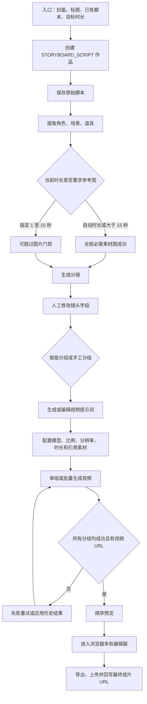

# 同程 MCN 平台「脚本创作」功能深度拆解分析

> 调研对象：<https://tcwlservice.17usoft.com/market/mcn/ai-creation/video>
> 调研时间：2026-07-17
> 调研范围：视频创作中的「脚本创作 / 脚本成片」
> 调研方式：刷新并复用用户登录态进行只读页面走查，同时核对当前生产静态构建中的路由、组件、状态机、交互和 API。未执行生成、保存、上传、删除、发布、导出或其他可能产生费用的数据写入操作。

## 一、结论先行

「脚本创作」不是一个从主题开始写文案的 AI 脚本生成器，而是一套把**已有脚本加工为视频成片**的半自动生产工作台。它的真实主链路是：

```text
导入已有脚本
  -> 抽取角色、场景、道具
  -> 确认、生成或替换参考图
  -> 生成并人工修订分镜
  -> 自动或手工组成视频分组
  -> 生成、编辑和检查视频提示词
  -> 分组生成视频
  -> 顺序预览
  -> 进入浏览器多轨编辑器
  -> 保存最终成片
```

综合判断如下：

| 维度 | 结论 | 判断依据 |
| --- | --- | --- |
| 流程完整性 | 较成熟 | 已覆盖脚本、素材、分镜、分组、视频、剪辑和成片回写 |
| AI 可控性 | 较成熟 | 素材、分镜、分组、提示词和视频结果均保留人工修改或重生成入口 |
| 长任务恢复 | 较成熟 | 刷新或重新进入后可恢复最远步骤，并续轮询后台任务 |
| 脚本策划能力 | 偏弱 | 入口只接收已有脚本，缺少渠道、受众、卖点、语气、CTA 等结构化控制 |
| 成本控制 | 偏弱 | 批量视频生成前有高额扣费确认，但没有金额预估、预算上限和并发控制 |
| 运营闭环 | 偏弱 | 有作品状态和费用明细，但没有脚本成片专属漏斗、质量和发布转化看板 |
| 当前主要风险 | 需优先处理 | 「是否生成素材图片」开关疑似断链；「优化结构」实际只是重置固定模板 |

它最有价值的部分不是“接了三个视频模型”，而是把多个不稳定的 AI 任务组织成了一个**可恢复、可人工纠偏、可继续剪辑**的生产流程。当前短板主要在上游需求约束、成本前置治理和后半程运营数据，而不是缺少更多生成模型。

## 二、证据等级与边界

| 标记 | 含义 |
| --- | --- |
| E1 | 登录后页面实测可见 |
| E2 | 当前生产静态代码确认 |
| E3 | 基于 E1/E2 的产品判断 |
| NV | 本次没有执行真实生成或写操作，仍需专项验证 |

本报告严格区分以下边界：

- 当前账号的登录态已成功复用，脚本创作入口、视频作品列表和页面字段属于 E1。
- 五阶段流程、状态机、轮询、恢复、模型参数、步骤门禁及缺陷判断主要属于 E2。
- 未触发付费生成，因此生成质量、实际耗时、长脚本稳定性、费用落账和批量并发行为属于 NV。
- 报告不记录当前空间中的作品标题、成员姓名、手机号或内部费用总额。
- 当前生产代码里存在的“文本分类 + ASR 对齐素材”调用属于数字人口播/智能混剪页面，不属于脚本创作主链路。

## 三、功能定位与边界

### 3.1 三种视频创作模式的区别

| 模式 | 从什么开始 | 自动化重点 | 适合场景 |
| --- | --- | --- | --- |
| 我有创意 | 一句话创意 | 先生成脚本，再生成素材、分镜和视频 | 只有选题、尚无完整文案 |
| 脚本创作 | 已有完整脚本 | 从脚本抽取视觉元素，继续生产视频 | 文案已确定，需要快速视频化 |
| 智能混剪 | 口播稿 + 数字人 | 数字人口播、素材匹配和自动混剪 | 标准化口播或数字人内容 |

脚本创作的边界可以概括为：

- **包含**：脚本保存、语义抽取、参考图生产、分镜、分组、提示词、视频生成、预览、剪辑和成片保存。
- **不包含**：从一句话创意生成完整脚本，这是「我有创意」的能力。
- **不包含**：在素材提取阶段自动按文本分类并用 ASR 对齐既有视频库，这是数字人口播/混剪链路。
- **尚未形成**：发布排期、审核、渠道发布和效果归因的脚本视频专属闭环。

### 3.2 目标用户与核心任务

| 角色 | 在该流程中的核心任务 |
| --- | --- |
| 脚本/内容人员 | 导入和修订脚本，确认内容结构与对白 |
| 视频运营 | 选择画面风格、模型、比例、清晰度，控制生成批次和成本 |
| 视觉/剪辑人员 | 修订素材、分镜、提示词和视频片段，完成多轨剪辑 |
| 管理/财务人员 | 关注作品完成率、失败率、单条成本和预算偏差 |

生产代码没有证明这些角色已经被拆成独立权限；这里描述的是实际作业分工，而不是当前权限矩阵。

## 四、端到端业务流程



页面把主流程呈现为五个步骤：

1. 脚本
2. 素材
3. 分镜
4. 视频分组
5. 视频预览

视频预览之后还有一个没有放进五步导航、但实际决定能否交付的浏览器剪辑与成片保存环节。

## 五、入口与作品创建

### 5.1 输入项

| 输入项 | 约束 | 用途 | 证据 |
| --- | --- | --- | --- |
| 封面 | 可上传；前端校验不超过 10MB | 作品列表与最终内容封面 | E1/E2 |
| 标题 | 必填；最多 20 字 | 作品名称 | E1/E2 |
| 完整脚本 | 必填；当前未见最大字数限制 | 素材提取和分镜生成的核心输入 | E1/E2 |
| 视频时长 | 自动，或指定 1-120 秒 | 约束分镜总时长及素材门禁 | E1/E2 |
| 是否生成素材图片 | 仅指定 1-15 秒时显示 | 产品意图是控制短视频是否生成参考图 | E1/E2，当前疑似断链 |

### 5.2 创建动作

提交后前端会：

1. 把入口数据暂存在 `sessionStorage`。
2. 跳转到脚本成片工作台。
3. 创建类型为 `STORYBOARD_SCRIPT` 的视频作品。
4. 保存原始脚本文本。
5. 自动进入素材提取阶段。

标题和脚本的必填校验发生在跳转前。封面上传、作品创建或后续提取任一步失败，都会中断当前链路；但多处异常被空 `catch` 吞掉，用户拿不到完整失败原因。

## 六、步骤一：脚本

### 6.1 已有能力

- 直接粘贴或编写完整视频脚本。
- 支持用 `【开场】`、`【正文】`、`【结尾】` 手工标记结构。
- 不使用标记时，页面提示系统会自动分段。
- 脚本文本修改后 1.5 秒防抖自动保存。
- 页面展示保存中/已保存状态及保存时间。
- 进入下游步骤后，上游会按依赖关系只读，避免已生成结果与脚本失配。

### 6.2 实际处理方式

导入的脚本会原样保存，并在素材提取和分镜生成时作为 `scriptContent` 传给后端。当前前端未发现独立的脚本分段解析器，也没有看到渠道、受众、语气或品牌规范等结构化脚本对象。

### 6.3 「重新生成优化结构」的真实行为

页面文案是“可直接编辑脚本内容，或点击重新生成优化结构”，但点击后实际执行的是：

- 用一份固定的开场/正文/结尾通用模板覆盖当前脚本。
- 清空已经存在的素材、分镜和视频分组。
- 提示“脚本模板已重置”。
- 没有调用已经部署的 `/video/script/generate` 接口。

因此该功能当前不是 AI 优化，而是**重置模板**。这会同时带来文案误导和误清空下游结果的风险。

### 6.4 当前缺少的脚本控制项

当前脚本入口只有标题、自由文本和时长，缺少：

- 目标渠道与画幅场景。
- 目标受众与内容目的。
- 内容风格、语气、情绪、语速和语言。
- 必提卖点、品牌词、禁词和合规要求。
- 开场钩子、CTA 和目标时长分配。
- 旁白、人物对白、画外音和屏幕文字的结构化区分。
- 脚本版本、差异对比和一键回退。

这意味着后端只能从一段自由文本推断创作意图，生成稳定性高度依赖用户写脚本的成熟度。

## 七、步骤二：素材

### 7.1 素材抽取

平台会从脚本语义中抽取三类视觉对象：

| 类型 | 典型内容 | 后续用途 |
| --- | --- | --- |
| 角色 | 人物、身份、外观特征 | 角色一致性和镜头人物引用 |
| 场景 | 地点、环境、时间和氛围 | 分镜背景与视觉风格 |
| 道具 | 商品、物件、交通工具等 | 镜头关键物体与卖点呈现 |

这里的“素材提取”是角色、场景、道具的结构化抽取，不是自动从视频素材库做 ASR 匹配。

### 7.2 素材卡片与人工操作

每个素材对象包含名称、描述、预览图、状态、生成模型、任务和历史结果。确认的操作包括：

- 修改名称，长度上限 50 字。
- 修改描述，长度上限 500 字；描述会直接影响生图提示词。
- 选择画面风格，风格库按写实、动漫、3D 分类。
- 单张生成或批量生成。
- 生成失败后重试。
- 角色三视图、道具四宫格和场景提示词优化。
- 图生图编辑。
- 查看历史生成结果并应用回当前素材。
- 本地上传替换，单图前端限制不超过 20MB。
- 预览和下载素材图。

### 7.3 图片模型

| 模型 | 已确认用途 |
| --- | --- |
| `gpt-image-2` | 素材文生图、图生图 |
| `z-image` | 素材图片生成 |
| `nanobanana-pro` | 素材文生图、图生图 |

模型名称来自当前生产前端；本次未执行生成，不能据此比较质量、速度或单次费用。

### 7.4 素材门禁

代码当前按目标总时长计算是否必须准备参考图：

- 自动时长：要求素材图准备完成。
- 指定时长大于 15 秒：要求素材图准备完成。
- 指定 1-15 秒：允许在图片未全部成功时继续。

这套门禁本身是清晰的，但它没有读取入口的“是否生成素材图片”值。结果是：指定 1-15 秒时，不论开关选择什么，工作台都按“图片非必需”处理；自动时长或大于 15 秒时则强制要求图片。

### 7.5 异步任务

素材图任务使用统一任务状态：`IDLE`、`GENERATING`、`SUCCESS`、`FAILED`。前端每 3 秒查询一次，最长等待 30 分钟；超时后任务可能仍在后台继续，用户刷新或重新进入作品时会恢复轮询。

## 八、步骤三：分镜

### 8.1 分镜对象

| 字段 | 说明 | 当前人工编辑情况 |
| --- | --- | --- |
| 镜头号 | 镜头顺序标识 | 主要用于展示和排序 |
| 时长 | 单镜头秒数 | 可编辑 |
| 场景 | 关联场景素材 | 可查看/关联 |
| 角色 | 关联一个或多个角色素材 | 可查看/关联 |
| 道具 | 关联一个或多个道具素材 | 可查看/关联 |
| 景别 | 远景、全景、中景、近景等 | 可编辑 |
| 机位/视角 | 镜头观察角度 | 可编辑 |
| 运镜 | 推、拉、摇、移等 | 可编辑 |
| 朝向 | 画面或人物朝向 | 对象中存在，进入提示词字段 |
| 画面描述 | 视频画面的核心语义 | 可编辑，提示词始终包含 |
| 说话人 | 对白来源 | 可编辑 |
| 说话内容 | 对白文本 | 可编辑 |
| 音效/特效/转场 | 视听效果 | 对象中存在，部分进入提示词 |
| 起止时间 | 时间轴定位 | 由系统维护 |
| 分组 ID | 镜头所属视频分组 | 分组后由系统维护 |

### 8.2 生成与修改

- 分镜生成请求会携带完整脚本、视觉风格和可选总时长。
- 页面支持逐镜头修改，失焦后保存。
- 进入分组前还会批量保存镜头修改，避免只保存在浏览器内存。
- 可重新生成分镜；如果已有分组，会提示分组和视频结果将被清空。
- 分镜生成按作品状态轮询，每 5 秒查询一次，最长 15 分钟。

### 8.3 产品判断

分镜阶段是该产品最核心的“AI 到人工”交接面。它把不可控的长视频生成问题拆成可检查的小镜头，并允许运营在产生更高视频费用前纠正时长、画面和对白。这一设计是正确的，但还缺少批量套用、镜头模板、版本对比和质量检查规则。

## 九、步骤四：视频分组

### 9.1 分组方式

- **智能分组**：后端根据分镜、模型和时长限制自动组成若干视频组。
- **手工分组**：用户自行决定镜头如何组合。
- 分组完成后，镜头会写入对应 `groupId`。
- 重新分组或重新生成全部提示词可能清空已生成的视频结果，页面会做二次确认。

分组的必要性来自视频模型的单次时长上限：一个最长 120 秒的作品必须拆成多个不超过 15 秒的片段，最后再进入编辑器拼接。

### 9.2 视频模型与参数

| 模型 | 单组时长 | 分辨率 | 画幅比例 |
| --- | --- | --- | --- |
| Seedance 2.0 | 4-15 秒 | 480p、720p | 16:9、9:16、1:1 |
| Kling v3 Omni | 3-15 秒 | 480p、720p | 16:9、9:16、1:1 |
| 快乐马 | 3-15 秒 | 720p、1080p | 16:9、9:16、1:1 |

页面会在切换模型时自动修正不支持的分辨率和越界时长，并把单组参数保存到后端。

### 9.3 视频提示词

提示词有两种生成方式：

| 方式 | 行为 | 优点 | 风险 |
| --- | --- | --- | --- |
| LLM 润色 | 按所选视频模型优化表达 | 自然度和模型适配更好 | 增加耗时、调用和不可预测性 |
| 直接拼接 | 按字段拼接，不调用大模型 | 更快、更可控 | 依赖分镜字段质量 |

直接拼接时，画面描述始终包含；用户还可以选择景别、机位、运镜、朝向、对白、音效和转场。

提示词相关操作包括：

- 单组手工编辑，失焦保存。
- 单组重新生成。
- 按目标模型重新生成全部分组提示词。
- 敏感词检查，并标记可能的敏感词。
- 模型改变且提示词格式不兼容时，提示先重新生成提示词。

### 9.4 多模态引用

分组可以添加或移除图片、视频和音频素材。不同模型的引用语法不同：

- Kling 主要使用 `<<<image_n>>>` 图片引用。
- Seedance 和快乐马支持 `@图片n`、`@视频n`、`@音频n` 形式的多模态引用。

这一能力发生在视频分组阶段，不能与素材提取阶段混为一谈。

### 9.5 视频生成

支持：

- 按单个分组生成视频。
- 按单个镜头直接生成视频。
- 一键为全部可生成分组派发任务。
- 失败后重试。
- 查看历史视频结果并应用回当前分组。

生成请求会携带作品、分组或镜头、模型、画幅、分辨率、时长、提示词，以及当前分组引用的图片、视频和音频列表。

批量生成前，页面明确提示“会产生较大额度算力扣费，且无法中途撤回”，用户必须二次确认。但确认框只说明风险，不展示预计金额、预算上限或分组费用拆解；确认后前端会逐组直接派发任务，也没有可见的并发队列控制。

视频任务和素材图任务共用 3 秒轮询、最长 30 分钟的任务机制。

## 十、步骤五：视频预览与成片

### 10.1 进入预览的硬门禁

只有同时满足以下条件，页面才允许进入视频预览：

- 已存在视频分组。
- 没有仍在生成的分组。
- 没有失败的分组。
- 所有分组状态都是 `SUCCESS`。
- 每个分组都存在有效 `videoUrl`。

因此，任意一个片段失败都会阻断完整预览。用户必须重试失败分组或应用一个历史结果。

### 10.2 预览与剪辑交接

- 分组视频按 `sortOrder` 顺序播放。
- 支持基础播放、进度拖动和静音控制。
- 进入剪辑时，所有片段会按顺序放到同一个视频轨。
- 分组字幕 SRT 会同步进入剪辑工程。
- 如果作品已经存在编辑工程，会优先恢复上次工程，而不是重新创建。

### 10.3 浏览器编辑器

与脚本成片直接相关的已确认能力包括：

- 多轨时间轴、拖拽、移动、裁剪、拆分、复制、粘贴和删除。
- 视频、图片、音乐、音效、字幕、花字和贴纸素材。
- 片段倍速、转场、画布比例和画面变换。
- 字幕逐条编辑、拆分、合并、样式、动画和重点文案。
- TTS 配音、音色、音量和静音。
- 视频、字幕和花字动画，关键帧及高级动画编辑。
- 本地封面和 AI 封面。
- 480p、720p、1080p 导出，低/推荐/高码率和硬字幕烧录。
- 生成进度、取消、成片预览和保存到本地。

### 10.4 最终成片保存

编辑器导出后，前端会上传成片并调用作品接口回写最终视频 URL。写回失败时最多重试 3 次。完成作品在视频列表可以预览，但当前列表页没有发现独立下载按钮；本地保存入口依赖编辑器导出流程。

## 十一、核心业务对象

| 对象 | 关键字段 | 生命周期中的作用 |
| --- | --- | --- |
| 视频作品 | 标题、类型、时长、封面、默认模型、比例、分辨率、状态、最终 URL | 聚合整个脚本成片任务 |
| 脚本 | 原始文本、更新时间 | 素材和分镜的语义源 |
| 素材对象 | 类型、名称、描述、图片、模型、任务、历史 | 保持角色、场景、道具的一致性 |
| 分镜 | 镜头字段、时长、对白、素材关系、组 ID | 把脚本拆成可执行的视觉单元 |
| 视频分组 | 镜头列表、提示词、模型参数、引用素材、状态、视频 URL | 对应一次视频模型调用 |
| 生成任务 | 任务 ID、状态、结果 URL、封面、失败原因 | 承载异步图片和视频生成 |
| 剪辑工程 | 轨道、片段、字幕、音频、样式和工程 JSON | 承接 AI 片段并完成终稿 |
| 最终成片 | 最终 URL、封面、导出文件 | 作品交付结果 |

对象之间的依赖关系是单向的：脚本改变会影响素材、分镜、分组和成片；素材改变会影响分镜及后续；分镜改变会影响分组及视频。当前产品主要采用“上游锁定 + 重生成时清空下游”维持一致性，安全但返工成本较高。

## 十二、AI、人工与系统自动化边界

| 阶段 | AI 负责 | 人工负责 | 系统负责 |
| --- | --- | --- | --- |
| 脚本 | 脚本创作模式下基本不负责生成 | 提供、编辑和确认完整脚本 | 自动保存和恢复 |
| 素材 | 抽取对象、优化提示词、生成图片 | 改名称/描述、选风格、上传替换、采用历史结果 | 异步任务、状态汇总和门禁 |
| 分镜 | 生成镜头拆解和初始字段 | 修订时长、景别、机位、运镜、画面和对白 | 批量保存和状态轮询 |
| 分组 | 智能分组、按模型生成提示词 | 手工分组、选择模型参数、检查提示词和素材引用 | 参数校验和分组状态维护 |
| 视频 | 分组视频生成 | 决定生成批次、重试或采用历史结果 | 任务轮询、成功/失败状态和预览门禁 |
| 成片 | 可辅助封面、字幕和 TTS | 时间轴剪辑、字幕、音频、转场、导出 | 恢复工程、上传和回写最终 URL |

该设计的核心思想是“AI 给初稿，人做关键决策，系统保证任务不丢”。这是面向团队生产而不是一次性 Demo 的正确方向。

## 十三、状态机、恢复和异常处理

### 13.1 作品状态

生产代码确认了以下阶段状态：

| 阶段 | 状态 |
| --- | --- |
| 脚本 | `SCRIPT_GENERATING`、`SCRIPT_DONE`、`SCRIPT_FAILED` |
| 素材 | `MATERIAL_EXTRACTING`、`MATERIAL_FAILED` |
| 分镜 | `STORYBOARD_GENERATING`、`STORYBOARD_FAILED`、`STORYBOARD_DONE` |
| 分组 | `GROUPING`、`GROUPING_FAILED` |
| 成片 | `COMPLETED` |

`SCRIPT_GENERATING` 主要服务“一句话创意先生成脚本”的链路；导入已有脚本的主流程直接保存脚本后进入素材提取。

### 13.2 任务状态

素材图片和分组视频使用：

```text
IDLE -> GENERATING -> SUCCESS / FAILED
```

### 13.3 轮询规则

| 任务 | 周期 | 最长等待 |
| --- | --- | --- |
| 作品阶段：素材提取、分镜、分组 | 5 秒 | 15 分钟 |
| 提示词就绪 | 3 秒 | 5 分钟 |
| 素材图片和分组视频 | 3 秒 | 30 分钟 |

超时不等于后端任务一定终止。页面会提示稍后刷新，重新进入后再根据状态续跑。

### 13.4 恢复机制

重新打开已有作品时，页面会依次读取：

1. 作品参数和状态。
2. 已保存脚本。
3. 素材对象和图片任务。
4. 分镜。
5. 视频分组和视频任务。
6. 已有剪辑工程。

页面随后定位到最远已完成或仍在执行的步骤。若检测到素材提取、分镜、分组、素材图或视频仍在后台运行，会恢复轮询。这是当前功能最成熟、最值得复用的部分之一。

### 13.5 异常处理短板

- 多处请求使用空 `catch`，失败后只结束加载状态，不展示后端错误。
- 脚本自动保存失败时会清空保存状态，但没有明确失败提示和重试按钮。
- 超时、后台继续运行和真正失败在用户感知上不够容易区分。
- 批量生成后无法中途撤回，但页面没有任务队列、并发数或逐组预计费用。
- 上游重生成会清空下游，虽有警告，但没有依赖差异分析和局部失效能力。

## 十四、模型与计费触点

### 14.1 已确认的计费维度

当前视频计费明细的动态列已经出现：

- Seedance 2.0 720 视频生成。
- Gemini 3.1 Pro Preview 分镜生成。
- Image2 素材图片。
- Gemini 脚本处理。
- 服务、存储和网络成本。

这些列证明平台已按生成环节拆分费用，但不能证明每个导入已有脚本的作品都会产生“Gemini 脚本处理”费用。

### 14.2 可能的成本构成

```text
单条作品总成本
  = 素材图片生成成本
  + 分镜生成成本
  + 提示词 LLM 处理成本（如计费）
  + 各视频分组生成成本
  + 服务、存储和网络成本
  + 失败重试与重生成成本
```

真正容易失控的是“分组数 × 重生成次数”。入口最长支持 120 秒，而单组视频最多 15 秒；长作品会自然拆成多个付费任务，任何提示词、画面一致性或单组失败都可能增加重生成成本。

### 14.3 当前成本控制缺口

- 素材图生成前没有本作品预计费用。
- 分镜生成前没有预计费用。
- 选择视频模型、分辨率和分组后，没有分组级金额预估。
- 批量生成有风险确认，但没有预计总额和预算上限。
- 没有“超预算自动停止”或“只生成前 N 组试片”。
- 没有把失败重试、人工替换和最终实际成本汇总到作品详情。

## 十五、当前真实使用表现

### 15.1 当前页面快照

登录后当前空间的视频作品总数为 22，第一页实际加载 20 条。其中识别到脚本创作作品 16 条，状态分布为：

| 当前状态 | 数量 | 占当前页脚本作品比例 |
| --- | ---: | ---: |
| 分镜已完成 | 7 | 43.75% |
| 已完成 | 4 | 25.00% |
| 失败 | 3 | 18.75% |
| 脚本已完成 | 2 | 12.50% |
| 合计 | 16 | 100.00% |

### 15.2 如何解读

当前样本最明显的信号是：**作品主要停留在“分镜已完成”，而不是最终成片**。这说明从分镜进入视频分组、付费生成、失败重试和最终剪辑的后半程存在明显阻力，可能包括：

- 视频生成费用高于上游步骤，用户会在分镜后重新判断是否继续。
- 分组、提示词、素材引用和模型参数需要较多人工判断。
- 任意分组失败都会阻断最终预览。
- 最终成片仍需要进入复杂的浏览器编辑器。
- 当前列表没有显式呈现下一步动作、预计成本和剩余工作量。

以上只是当前账号、当前时点、当前第一页的横截面信号，不是按创建日期追踪的 cohort，也不能被解释为长期成功率、失败率或全空间完成率。总数 22 中未加载的 2 条也可能改变整体分布。

## 十六、产品优势

### 16.1 不是一次性黑盒生成

素材、分镜、分组、提示词和视频结果都有人工介入点。AI 结果可以局部修改、重试或用历史结果替换，不需要每次从头重来。

### 16.2 对长任务和页面刷新友好

素材图和视频任务可以跨页面继续运行，重新进入后恢复状态和轮询。相比只靠页面内 Promise 等待，这更适合真实生产。

### 16.3 在高费用视频生成前设置了审核面

用户可以先检查素材和分镜，再决定是否生成视频。批量视频生成还有不可撤回和高额扣费确认，至少避免了完全无感派发。

### 16.4 多模型不是简单下拉框

系统同时处理模型的时长、分辨率和提示词格式差异，并在不兼容时阻止直接切换，说明产品已经考虑模型适配层。

### 16.5 AI 片段能够进入专业剪辑流程

最终不是简单拼接下载，而是进入多轨编辑器继续处理字幕、配音、音频、转场和封面。这让生成片段有机会成为可交付成片。

## 十七、主要问题与风险

| 优先级 | 问题 | 已确认表现 | 业务影响 |
| --- | --- | --- | --- |
| P0 | 「是否生成素材图片」开关断链 | 入口写入 `generateImage`，工作台没有消费；实际门禁只按时长判断 | 用户选择与实际流程不一致，可能误跳过或误强制素材图 |
| P1 | 「重新生成优化结构」名实不符 | 实际覆盖为固定模板并清空下游，没有调用 LLM | 误导用户，并可能造成返工损失 |
| P1 | 脚本输入缺少结构化约束 | 只有标题、自由文本、时长 | 生成质量依赖个人经验，难以规模化复用 |
| P1 | 成本提示过晚且无金额 | 只有批量视频生成前做风险确认 | 用户无法在素材、分镜和模型选择阶段管理预算 |
| P1 | 批量派发缺少队列与预算保护 | 确认后前端逐组直接派发 | 并发、重复提交和成本放大难以治理 |
| P1 | 返工采用级联清空 | 重生成上游会清空下游 | 小修改也可能造成大量重做和重复费用 |
| P1 | 异常信息不透明 | 多处空 `catch`，自动保存失败无明确提示 | 用户不知道失败原因，也难以判断是否该重试 |
| P2 | 缺少脚本版本历史 | 历史主要覆盖图片/视频生成结果 | 无法安全回退脚本文本和比较改动 |
| P2 | 缺少视频生产漏斗 | 只有最终作品状态，没有阶段耗时和转化 | 无法定位“分镜完成后”具体卡在哪里 |
| P2 | 列表交付动作不完整 | 完成态只见预览，未见独立下载 | 已完成作品二次取用不便 |

## 十八、建议优化路线

### P0：先修正确性与成本底线

1. 打通 `generateImage` 从入口、作品创建、素材提取、页面恢复到步骤门禁的完整参数链。
2. 明确自动时长、1-15 秒和大于 15 秒三种规则，并把规则直接展示在开关旁。
3. 批量生成增加服务端幂等键、作品级生成锁和并发上限，确保重复点击不产生重复计费。
4. 在最终确认框展示分组数、模型、分辨率、总生成秒数、预计金额区间和预算上限。

### P1：提升脚本到分镜的可控性

1. 把入口升级为“脚本 + 创作简报”：渠道、受众、目的、语气、语言、语速、卖点、禁词、CTA、目标画幅。
2. 将“重新生成优化结构”改成真正的 AI 结构优化，并先展示差异；如果暂不实现，应改名为“重置为通用模板”。
3. 增加脚本版本、分镜版本和一键回退。
4. 从“级联清空”升级为依赖差异：只失效受改动影响的素材、镜头和分组。
5. 增加长脚本字数、预计镜头数、预计分组数和超长风险提示。
6. 所有异步请求统一展示可复制的错误原因、任务 ID、重试和稍后恢复入口。

### P2：形成运营与交付闭环

1. 建立脚本视频漏斗和阶段耗时看板。
2. 增加素材人工替换率、分镜修改率、提示词重生成率、视频失败率和重试成本。
3. 增加预计成本与实际成本偏差、单条预算和团队月度预算。
4. 在完成作品列表提供独立下载、继续剪辑、复制作品和发布状态。
5. 将视频作品连接到审核、渠道发布和曝光/互动/转化归因。

## 十九、建议验收标准

### 19.1 功能正确性

- 指定 1-15 秒时，开关开启与关闭必须产生不同且可审计的后端请求与步骤门禁。
- 刷新和重新进入后，开关、时长、风格、模型、比例和分辨率保持一致。
- “优化结构”要么实际调用 AI 并展示变更差异，要么文案明确为“重置模板”。
- 修改脚本后，系统明确展示哪些素材、分镜和分组将失效，不得静默保留脏数据。
- 所有分组成功且有 URL 时才能进入预览；任何失败组都能单独重试或采用历史结果。

### 19.2 可靠性与成本

- 同一作品、同一分组、同一参数的重复提交不能产生重复任务或重复计费。
- 批量生成前 100% 展示预计总成本、计算依据和预算余额。
- 所有失败状态 100% 提供错误原因、任务 ID 和可执行的恢复动作。
- 自动保存失败必须在 3 秒内可见，并支持自动或手工重试。
- 浏览器刷新、关闭后重开和跨页面返回均能恢复最远一致状态。
- 成片回写重试失败后保留已上传 URL，避免重新导出和重复上传。

### 19.3 运营指标

建议最小漏斗事件为：

```text
作品创建
  -> 素材提取成功
  -> 素材准备完成
  -> 分镜生成完成
  -> 分组完成
  -> 首个视频任务提交
  -> 全部分组成功
  -> 进入剪辑
  -> 成片保存
  -> 下载或发布
```

每个事件至少记录作品 ID、空间、创建人、时间、模型、规格、预计成本、实际成本、重试次数、人工修改次数和失败原因。人员相关报表应按权限脱敏。

## 二十、关键生产代码证据索引

| 证据 | 当前生产代码位置 |
| --- | --- |
| 视频工作、脚本、素材、分镜、分组 API | `/tmp/tcwl_note.pretty.js:9846` |
| 五步导航、完成门禁、上游只读 | `/tmp/tcwl_note.pretty.js:351798` |
| 脚本 1.5 秒自动保存 | `/tmp/tcwl_note.pretty.js:351857` |
| 作品、脚本、素材、分镜、分组恢复 | `/tmp/tcwl_note.pretty.js:351960` |
| 后台任务续轮询 | `/tmp/tcwl_note.pretty.js:352127` |
| 固定模板重置行为 | `/tmp/tcwl_note.pretty.js:352275` |
| 脚本素材抽取请求 | `/tmp/tcwl_note.pretty.js:352305` |
| 分镜生成和编辑保存 | `/tmp/tcwl_note.pretty.js:352466` |
| 分组、提示词和预览门禁 | `/tmp/tcwl_note.pretty.js:352567` |
| 视频任务参数、批量派发和分组素材 | `/tmp/tcwl_note.pretty.js:353004` |
| 图片模型和素材卡片能力 | `/tmp/tcwl_note.pretty.js:252344` |
| 视频模型、时长和分辨率约束 | `/tmp/tcwl_note.pretty.js:257865` |
| 高额扣费且不可撤回确认 | `/tmp/tcwl_note.pretty.js:258268` |
| 入口 `generateImage` 写入 | `/tmp/tcwl_note.pretty.js:366754` |
| 工作台未消费 `generateImage` | `/tmp/tcwl_note.pretty.js:351913` |
| ASR 素材匹配调用属于数字人页面 | `/tmp/tcwl_note.pretty.js:362507` |

## 二十一、最终判断

同程 MCN 的脚本创作已经具备一套可用于真实团队生产的“脚本到成片”骨架：阶段清晰、AI 结果可编辑、任务可恢复、模型差异有适配、视频片段可以进入完整剪辑器。它不是简单的提示词套壳。

但当前还没有达到“低门槛、可预算、可规模复制”的状态。最先要解决的不是再接一个模型，而是修正素材图片开关、把脚本要求结构化、让优化动作名实一致、把成本预估提前到生成之前，并用阶段漏斗解释为什么大量作品停在分镜完成。完成这些改造后，这条链路才会从“能生产”提升到“可稳定运营”。
